# 功能函数设计与协作脉络

[English README](README.md) | [中文 README](README.zh-CN.md) | [函数速查](FUNCTION_GUIDE.md) | [项目结构](PROJECT_STRUCTURE.md)

本文档的目标不是简单罗列函数，而是解释这个双 STM32 项目中“每个涉及功能的函数为什么这样设计、如何互相配合、数据如何从传感器一路流到 OLED/报警/Flash”。如果要准备答辩，可以按本文的顺序讲：先讲系统总架构，再讲双角色编译，再讲采集链路、通信链路、显示报警链路，最后讲可选 Flash 记录和异常恢复。

## 1. 总体设计思路

项目用两块 STM32F103C8T6 做分布式系统：

| 节点 | 角色 | 核心任务 | 关键函数 |
|---|---|---|---|
| 板 A | SENSOR 采集节点 | 读取 DHT11、MQ135、MQ2、火焰模块，打包数据帧，通过 USART3 发送 | `Sensor_App_Run()`、`DHT11_Read()`、`ADC1_ReadChannel()`、`Frame_Encode()`、`Sensor_SendFrame()` |
| 板 B | MONITOR 显示报警节点 | 接收 USART3 数据帧，解析校验，刷新 OLED，驱动 RGB/蜂鸣器，处理按键，可选记录 Flash | `Monitor_App_Run()`、`Monitor_ProcessRx()`、`Frame_Decode()`、`Monitor_UpdateAlarm()`、`Monitor_UpdateDisplay()`、`Flash_LogFrame()` |

这套设计的重点是“同一份源码，两个固件”。公共协议、公共串口工具、公共数据结构都保留在同一个 `main.c` 中，再由 CMake 编译参数决定当前生成板 A 还是板 B。

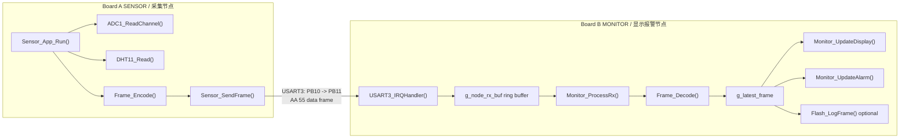

## 2. 编译期角色选择

项目没有写两套工程，而是通过 `APP_NODE_ROLE` 选择角色：

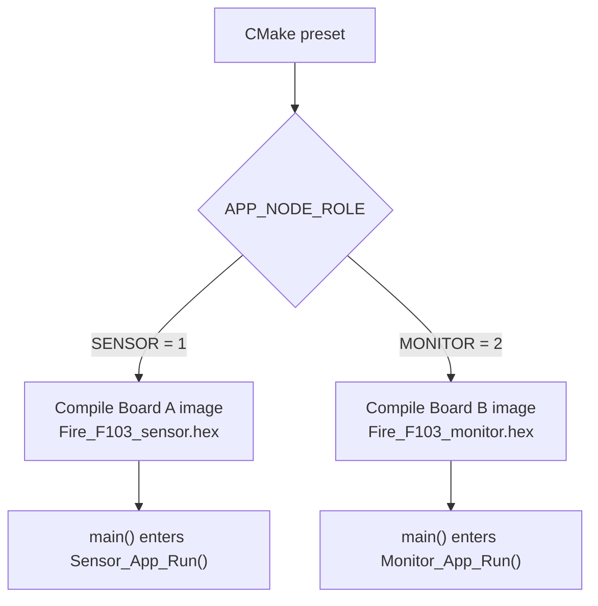

| 设计点 | 实现位置 | 说明 |
|---|---|---|
| 角色宏 | `APP_ROLE_SENSOR`、`APP_ROLE_MONITOR` | 用数字区分两个节点，便于 `#if APP_NODE_ROLE == ...` 条件编译 |
| CMake 传参 | `CMakeLists.txt` | `SensorDebug` 传 `APP_NODE_ROLE=1`，`MonitorDebug` 传 `APP_NODE_ROLE=2` |
| 未用函数抑制告警 | `APP_MAYBE_UNUSED` | 因为同一文件同时包含两个节点的函数，某些函数在另一个角色里不会被调用 |
| 输出文件区分 | `Fire_F103_sensor`、`Fire_F103_monitor` | 防止两个固件产物互相覆盖 |

这种方式的好处是：协议结构和工具函数只维护一份，板 A 和板 B 不容易出现“发送格式改了，接收格式忘改”的问题。

## 3. 启动链路：从复位到进入角色主循环

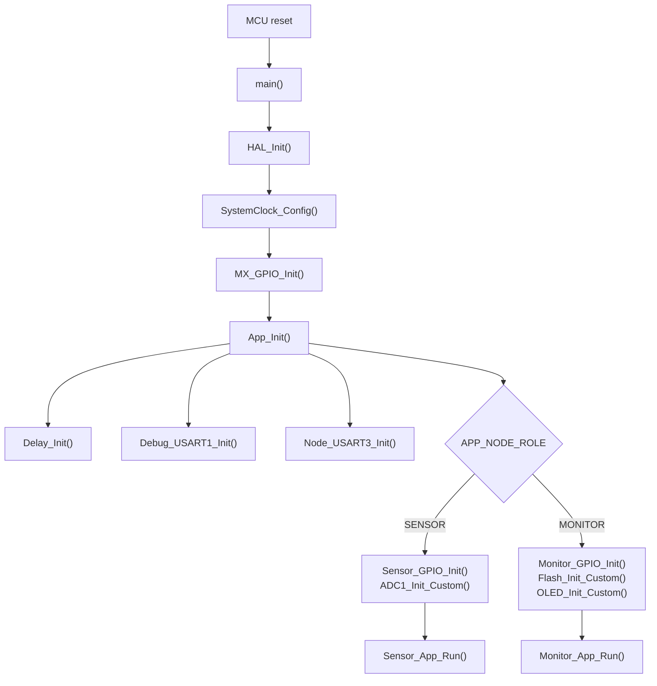

| 函数 | 设计意图 | 协作关系 |
|---|---|---|
| `main()` | 固件统一入口，只负责初始化和进入角色循环 | 调用 `HAL_Init()`、`SystemClock_Config()`、`MX_GPIO_Init()`、`App_Init()` |
| `SystemClock_Config()` | 统一配置 72 MHz 系统时钟，保证串口、ADC、DWT 延时计算一致 | USART1 使用 72 MHz，USART3/SPI2 位于 APB1，按 36 MHz 计算 |
| `MX_GPIO_Init()` | 初始化板载 K1/K2 和 RGB LED | 来自 CubeMX 风格文件 `gpio.c`，显示节点后续用 `LED_Set()` 和按键读取 |
| `App_Init()` | 把“公共初始化”和“角色专属初始化”分开 | 两个节点都初始化 USART1、USART3；采集节点再初始化传感器和 ADC；显示节点再初始化 OLED、蜂鸣器、Flash |
| `Delay_Init()` | 启用 DWT 周期计数器，提供微秒级延时基础 | `DHT11_Read()`、软件 I2C 都依赖 `Delay_Us()` |
| `Debug_USART1_Init()` | 固定 USART1 为调试通道，避免占用 PA9/PA10 做外设 | `printf()` 通过 `__io_putchar()` 输出到 USART1 |
| `Node_USART3_Init()` | 建立 PB10/PB11 双板通信通道 | 显示节点额外开启 `USART3_IRQHandler()` 中断接收 |
| `Error_Handler()` | HAL 初始化失败时进入不可恢复错误状态 | `SystemClock_Config()` 中时钟配置失败会调用它 |
| `assert_failed()` | 开启 `USE_FULL_ASSERT` 后提供断言失败入口 | 默认只保留参数，方便后续扩展为串口打印文件名和行号 |

### 初始化分层

初始化被拆成三层，是为了降低调试复杂度：

| 层级 | 内容 | 为什么这样拆 |
|---|---|---|
| HAL/时钟层 | `HAL_Init()`、`SystemClock_Config()` | 先保证系统 tick、时钟和外设时钟基础正确 |
| 板载公共层 | `MX_GPIO_Init()`、`Debug_USART1_Init()`、`Node_USART3_Init()` | 两块板都需要串口日志和双板通信能力 |
| 角色业务层 | `Sensor_GPIO_Init()`、`ADC1_Init_Custom()`、`Monitor_GPIO_Init()`、`OLED_Init_Custom()`、`Flash_Init_Custom()` | 避免采集节点初始化 OLED，也避免显示节点初始化 MQ/DHT11 |

## 4. 板 A 采集节点：采样、滤波、打包、发送

板 A 的核心是 `Sensor_App_Run()`，它每 1 秒执行一次采样任务。

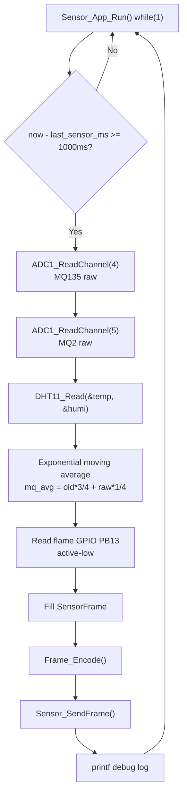

### 4.1 传感器 GPIO 与 ADC 初始化

| 函数 | 输入/输出 | 设计细节 |
|---|---|---|
| `Sensor_GPIO_Init()` | 无输入；配置 PA4、PA5、PB12、PB13 | PA4/PA5 配成模拟输入给 MQ135/MQ2；PB13 配成上拉输入读取火焰 DO；PB12 配成开漏输出兼容 DHT11 单总线 |
| `ADC1_Init_Custom()` | 无输入；直接配置 ADC1 寄存器 | 使用 ADC1，采样通道 4/5；设置 ADC 时钟为 12 MHz；执行复位校准和自校准，提升读数稳定性 |
| `ADC1_ReadChannel(channel)` | 输入 ADC 通道号；输出 12 位 ADC 值 | 每次只采一个通道，适合当前两个 MQ 模块低频采样场景，逻辑简单、可讲清楚 |

### 4.2 DHT11 读取链路

DHT11 不是普通 UART/I2C/SPI，而是一个对时序要求较严格的单总线模块，所以拆成几个小函数：

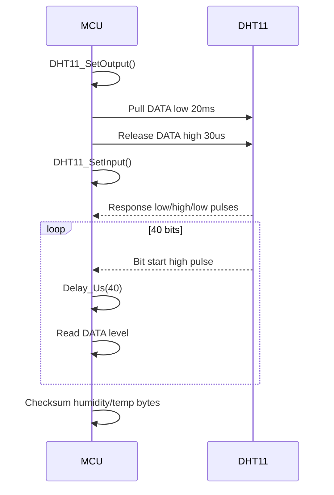

| 函数 | 设计作用 | 与其他函数的关系 |
|---|---|---|
| `DHT11_SetOutput()` | 把 PB12 切换成开漏输出，让 MCU 能拉低总线发起读取 | 被 `DHT11_Read()` 调用 |
| `DHT11_SetInput()` | 把 PB12 切换成输入，让 DHT11 能输出回应和 40 位数据 | 被 `DHT11_Read()` 调用 |
| `DHT11_WaitLevel(level, timeout_us)` | 等待数据线到达指定电平，并用超时避免死等 | `DHT11_Read()` 中每个回应阶段、每一位读取阶段都依赖它 |
| `DHT11_Read(temp, humi)` | 完整执行 DHT11 协议，输出温度和湿度 | 成功返回 `1`；失败返回 `0`，失败状态会写入 `STATUS_DHT_ERROR` |

DHT11 失败时，项目不让整个系统卡住，而是继续发送数据帧，并在 `status` 里标记错误。这是一个很重要的设计点：传感器短暂失败不会导致通信和显示链路停摆。

### 4.3 MQ 传感器滤波

MQ135/MQ2 输出是模拟量，容易抖动。代码使用指数滑动平均：

```text
first sample: avg = raw
next samples: avg = (avg * 3 + raw) / 4
```

| 设计选择 | 原因 |
|---|---|
| 不保存数组窗口 | STM32F103C8T6 RAM 只有 20 KB，演示项目没必要保存大量历史样本 |
| 新样本权重 1/4 | 能降低抖动，又不会让报警反应太慢 |
| 用整数计算 | 避免引入浮点计算，代码更适合单片机 |

### 4.4 采集帧生成

`SensorFrame` 是板 A 和板 B 之间的“结构化数据契约”：

| 字段 | 来源 | 用途 |
|---|---|---|
| `temp` | `DHT11_Read()` | OLED 显示温度 |
| `humi` | `DHT11_Read()` | OLED 显示湿度 |
| `mq135_adc` | `ADC1_ReadChannel(4)` 后滤波 | 空气质量预警判断 |
| `mq2_adc` | `ADC1_ReadChannel(5)` 后滤波 | 烟雾预警/危险判断 |
| `flame` | PB13 火焰 DO | 危险报警判断 |
| `seq` | 本地自增序号 | 判断通信是否持续更新，便于串口日志观察 |
| `status` | DHT11 错误位等 | 显示节点判断传感器异常 |

## 5. 数据帧协议：把结构体变成串口字节

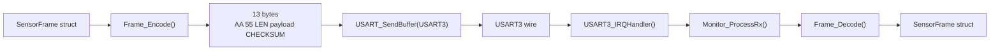

### 5.1 编码函数

| 函数 | 设计说明 |
|---|---|
| `Frame_Encode(frame, out)` | 把结构体按固定顺序写入 13 字节数组。帧头固定为 `AA 55`，长度固定为 `9`，ADC 高字节先发，最后写 checksum |
| `Frame_Checksum(data, len)` | 对 `LEN + payload` 累加并取低 8 位。算法很简单，适合课堂讲解和串口助手手算验证 |
| `Sensor_SendFrame(frame)` | 把“编码”和“通过 USART3 发送”封装到一起，让采集主循环不关心底层字节发送细节 |

### 5.2 解码函数

| 函数 | 设计说明 |
|---|---|
| `Frame_Decode(in, frame)` | 先检查帧头，再检查长度，最后检查 checksum，全部通过后才更新输出结构体 |
| `Monitor_ProcessRx()` | 负责从环形缓冲中拼完整帧，并在遇到噪声时重新寻找 `AA 55` 帧头 |

这种设计的关键是：解码失败时不更新 `g_latest_frame`。因此错误字节只会造成一帧丢失，不会把 OLED 显示污染成乱值。

### 5.3 帧格式表

| 序号 | 字节 | 名称 | 说明 |
|---|---|---|---|
| 0 | `0xAA` | `FRAME_HEAD0` | 帧头第 1 字节 |
| 1 | `0x55` | `FRAME_HEAD1` | 帧头第 2 字节 |
| 2 | `0x09` | `LEN` | payload 长度固定 9 |
| 3 | `temp` | 温度 | DHT11 温度整数 |
| 4 | `humi` | 湿度 | DHT11 湿度整数 |
| 5 | `mq135_adc >> 8` | MQ135 高字节 | 12 位 ADC 高位 |
| 6 | `mq135_adc & 0xFF` | MQ135 低字节 | 12 位 ADC 低位 |
| 7 | `mq2_adc >> 8` | MQ2 高字节 | 12 位 ADC 高位 |
| 8 | `mq2_adc & 0xFF` | MQ2 低字节 | 12 位 ADC 低位 |
| 9 | `flame` | 火焰状态 | `1` 表示检测到火焰 |
| 10 | `seq` | 序号 | 每帧递增 |
| 11 | `status` | 状态位 | bit0 表示 DHT11 读取错误 |
| 12 | checksum | 校验和 | `LEN + payload` 的低 8 位 |

## 6. 板 B 接收链路：中断收字节，主循环解析帧

显示节点最重要的设计之一是“中断只做最少工作，复杂解析放主循环”。

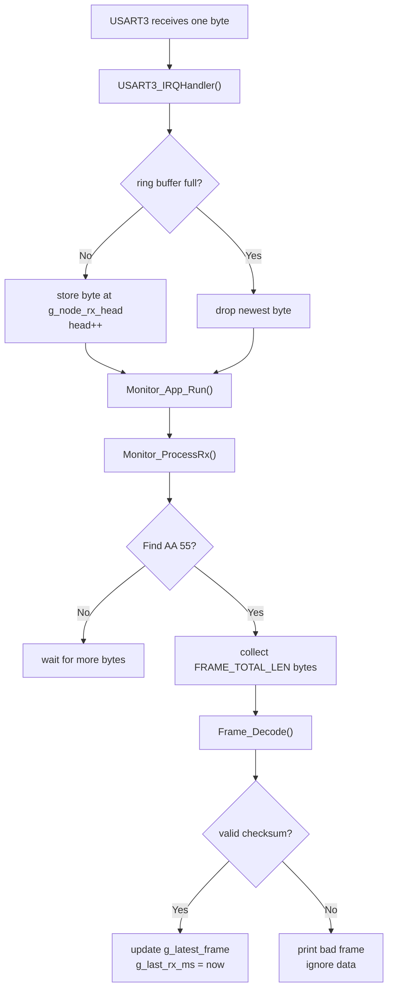

| 全局变量 | 所属链路 | 设计用途 |
|---|---|---|
| `g_node_rx_buf` | 串口接收 | USART3 中断和主循环之间的环形缓冲 |
| `g_node_rx_head` | 串口接收 | 中断写入位置 |
| `g_node_rx_tail` | 串口接收 | 主循环读取位置 |
| `g_latest_frame` | 显示/报警/记录 | 最近一帧合法采集数据 |
| `g_last_rx_ms` | 离线检测 | 最近一次收到合法帧的时间 |

### 为什么不用中断里直接解析？

| 方案 | 优点 | 缺点 |
|---|---|---|
| 中断里直接解析完整帧 | 主循环代码少 | 中断执行时间变长，OLED 或 Flash 逻辑难以协调，不利于扩展 |
| 中断只存字节，主循环解析 | 中断短小稳定，主循环逻辑清晰 | 需要环形缓冲和解析状态 |

本项目选择第二种，因为它更符合嵌入式常见设计：ISR 做最少事情，业务逻辑放到主循环。

## 7. 板 B 主循环：多任务协作调度

板 B 没有 RTOS，而是用时间片式 super-loop 调度。

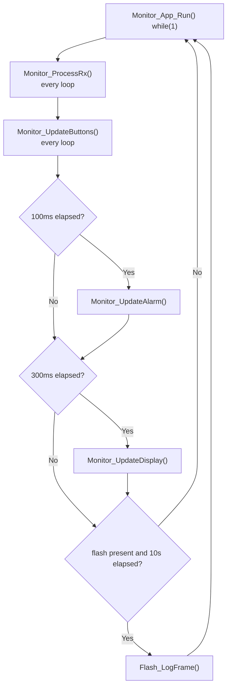

| 任务 | 执行频率 | 函数 | 设计原因 |
|---|---|---|---|
| 接收解析 | 每轮循环 | `Monitor_ProcessRx()` | 串口数据可能随时到来，越频繁处理越不容易积压 |
| 按键扫描 | 每轮循环 | `Monitor_UpdateButtons()` | 保证 K1/K2 手感及时 |
| 报警输出 | 每 100 ms | `Monitor_UpdateAlarm()` | 蜂鸣器闪烁/LED 状态需要较快更新 |
| OLED 刷新 | 每 300 ms | `Monitor_UpdateDisplay()` | OLED 刷新较慢，没必要每轮刷 |
| Flash 记录 | 每 10 s | `Flash_LogFrame()` | 降低写 Flash 频率，减少磨损 |

这里的协调方式是整个项目的主线之一：每个函数只负责一类任务，主循环用时间间隔把它们串起来。

## 8. 按键交互设计

按键函数 `Monitor_UpdateButtons()` 使用简单边沿检测，不使用阻塞式等待。

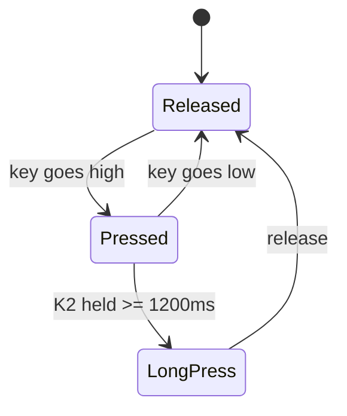

| 按键 | 动作 | 对应变量/函数 |
|---|---|---|
| K1 短按 | 切换 OLED 页面 | `g_page ^= 1u` |
| K2 短按 | 蜂鸣器静音 60 秒 | `g_mute_until_ms = now + MUTE_TIME_MS` |
| K2 长按 | 切换阈值档位 | `g_threshold_profile++` |

设计重点：

1. 使用 `k1_last`、`k2_last` 记录上一次电平，避免按住时重复触发。
2. K2 按下时记录 `k2_down_ms`，松开时根据持续时间区分短按和长按。
3. 静音只影响蜂鸣器，不影响 LED 颜色，这样危险状态仍然可见。

## 9. 报警判断与优先级

报警链路由三个判断函数和一个输出函数组成：

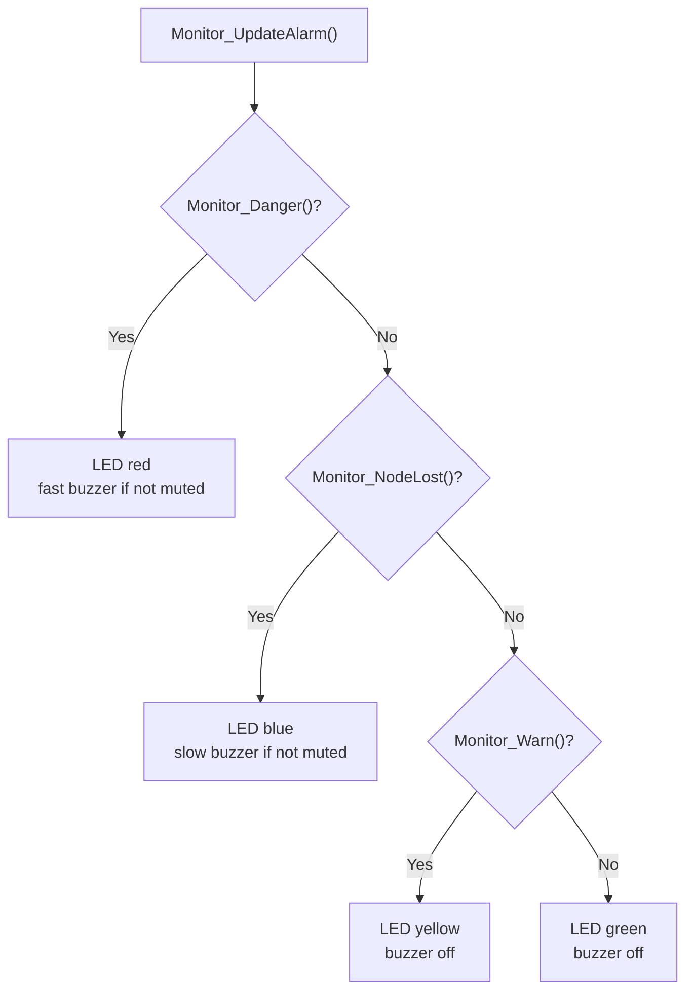

| 函数 | 判断依据 | 返回真时代表 |
|---|---|---|
| `Monitor_NodeLost()` | `HAL_GetTick() - g_last_rx_ms > NODE_TIMEOUT_MS` | 超过 3 秒没有收到合法采集帧 |
| `Monitor_Danger()` | 火焰触发或 MQ2 达到严重阈值 | 有真实危险，需要红灯和蜂鸣器 |
| `Monitor_Warn()` | DHT11 错误、MQ135 达到预警、MQ2 达到预警、或节点丢失 | 有异常或轻度风险 |
| `Monitor_UpdateAlarm()` | 综合以上判断 | 输出 RGB LED 和蜂鸣器节奏 |

### 优先级为什么这样排？

| 优先级 | 状态 | 原因 |
|---|---|---|
| 1 | Danger | 火焰/严重烟雾必须最高优先级 |
| 2 | Node lost | 没有数据时不能假装正常，需要明确提示通信故障 |
| 3 | Warning | 空气/烟雾接近阈值或传感器错误 |
| 4 | Normal | 没有异常 |

`Monitor_Danger()` 中如果节点丢失会直接返回假，是为了避免使用过期的旧火焰/烟雾数据继续判定危险；节点丢失由单独的蓝灯状态表达。

## 10. OLED 显示链路

OLED 相关函数分为三层：

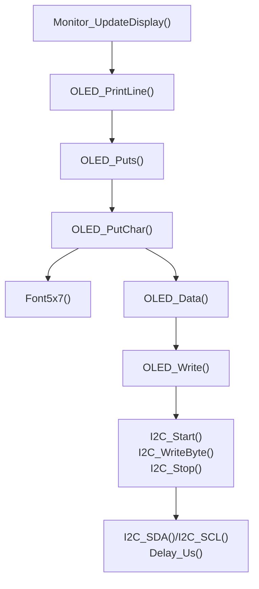

| 层级 | 函数 | 职责 |
|---|---|---|
| 页面层 | `Monitor_UpdateDisplay()` | 决定当前显示哪一页、每行显示什么内容 |
| 文本层 | `OLED_PrintLine()`、`OLED_Puts()`、`OLED_PutChar()`、`Font5x7()` | 将字符串转换成 5x7 点阵字符 |
| OLED 命令层 | `OLED_Init_Custom()`、`OLED_Clear()`、`OLED_SetCursor()`、`OLED_Cmd()`、`OLED_Data()` | 初始化 SSD1306、清屏、设置位置、发送命令/数据 |
| 软件 I2C 层 | `I2C_Start()`、`I2C_Stop()`、`I2C_WriteByte()`、`I2C_SDA()`、`I2C_SCL()`、`I2C_Delay()` | 用 GPIO 模拟 I2C 时序 |

### 页面设计

| 页面 | 内容 | 适合演示什么 |
|---|---|---|
| `g_page == 0` | 状态、温湿度、空气 ADC、烟雾 ADC 和火焰状态 | 常规监测界面 |
| `g_page == 1` | 阈值档位、空气阈值、烟雾阈值、帧序号和 Flash 状态 | 参数/调试界面 |

显示函数故意不显示太多内容，因为 0.96 寸 OLED 可读空间有限。每页 4 行可以保证答辩展示时老师能看清楚。

## 11. 可选 W25Q64 Flash 记录链路

Flash 是加分项，所以设计成“检测到就启用，没检测到也不影响主功能”。

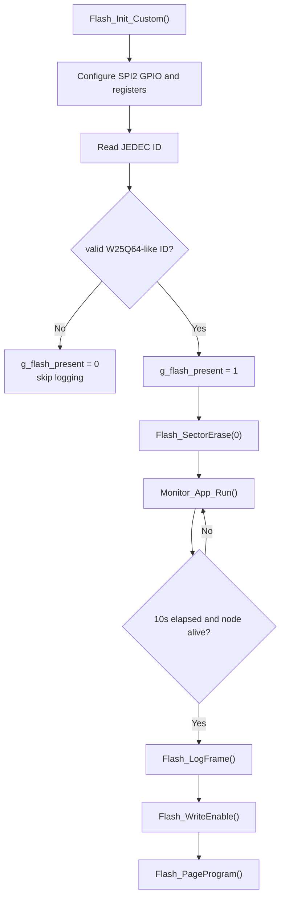

| 函数 | 设计作用 |
|---|---|
| `Flash_CS(high)` | 控制 PB12 片选，所有 SPI 命令都以拉低 CS 开始、拉高 CS 结束 |
| `SPI2_TxRx(data)` | SPI 全双工发送/接收 1 字节，是 Flash 驱动的底层工具 |
| `Flash_ReadStatus()` | 读取状态寄存器，主要关注 busy 位 |
| `Flash_WaitReady(timeout_ms)` | 等待擦写结束，防止 Flash 忙时继续发命令 |
| `Flash_WriteEnable()` | W25Q 写入/擦除前必须先写使能 |
| `Flash_SectorErase(addr)` | 擦除一个 4 KB 扇区，本项目使用扇区 0 做演示记录区 |
| `Flash_PageProgram(addr, data, len)` | 写入一条较短记录 |
| `Flash_Init_Custom()` | 初始化 SPI2，读取 JEDEC ID，决定是否启用记录 |
| `Flash_LogFrame(frame, state)` | 把采集数据、报警状态、tick 时间、阈值档位和 checksum 写入记录 |

### Flash 记录格式

| 字节范围 | 内容 | 说明 |
|---|---|---|
| 0 | `0xE1` | 记录头 |
| 1 | `0x03` | 记录版本 |
| 2 | `seq` | 采集帧序号 |
| 3 | `status` | 传感器状态位 |
| 4-5 | `temp`、`humi` | 温湿度 |
| 6-9 | MQ135/MQ2 ADC | 高字节在前 |
| 10 | `flame` | 火焰状态 |
| 11 | `state` | 0 正常、1 预警、2 危险 |
| 12-15 | `HAL_GetTick()` | 记录时刻 |
| 16 | `g_threshold_profile` | 当前阈值档位 |
| 17-18 | reserved | 预留 |
| 19 | checksum | 前 19 字节累加和 |

Flash 地址超过 4096 字节后会回到 0 并重新擦除扇区。这是演示型循环记录，简单直观，但不是工业级 wear-leveling。

## 12. 串口调试链路

两个节点都通过 USART1 输出日志：

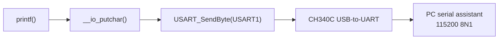

| 日志来源 | 典型输出 | 用途 |
|---|---|---|
| 采集节点 | `[SENSOR] seq=...` | 确认传感器读取、滤波、发送是否正常 |
| 显示节点 | `[MONITOR] rx seq=...` | 确认 USART3 接收和解码正常 |
| 显示节点 | `[MONITOR] bad frame` | 发现接线不稳或波特率不一致 |
| 显示节点 | `[MONITOR] threshold profile=...` | 确认 K2 长按切换阈值 |
| 显示节点 | `[MONITOR] flash log addr=...` | 确认 W25Q64 记录工作 |

`__io_putchar()` 会把 `\n` 前自动补 `\r`，这样很多 Windows 串口助手能正常换行显示。

## 13. 全局状态变量如何串联模块

| 变量 | 写入者 | 读取者 | 作用 |
|---|---|---|---|
| `g_latest_frame` | `Monitor_ProcessRx()` | `Monitor_UpdateDisplay()`、`Monitor_Danger()`、`Monitor_Warn()`、`Flash_LogFrame()` | 板 B 当前使用的最新采集数据 |
| `g_last_rx_ms` | `Monitor_ProcessRx()` | `Monitor_NodeLost()` | 判断采集节点是否离线 |
| `g_page` | `Monitor_UpdateButtons()` | `Monitor_UpdateDisplay()` | OLED 页面选择 |
| `g_threshold_profile` | `Monitor_UpdateButtons()` | `Monitor_Danger()`、`Monitor_Warn()`、`Monitor_UpdateDisplay()`、`Flash_LogFrame()` | 当前报警阈值档位 |
| `g_mute_until_ms` | `Monitor_UpdateButtons()` | `Monitor_UpdateAlarm()` | 蜂鸣器静音到期时间 |
| `g_flash_present` | `Flash_Init_Custom()` | `Monitor_App_Run()`、`Monitor_UpdateDisplay()`、`Flash_LogFrame()` | 是否检测到可用 W25Q64 |
| `g_flash_log_addr` | `Flash_Init_Custom()`、`Flash_LogFrame()` | `Flash_LogFrame()` | 下一条 Flash 记录写入地址 |
| `g_node_rx_buf/head/tail` | `USART3_IRQHandler()`、`USART_ReadByte()` | `USART_ReadByte()`、`Monitor_ProcessRx()` | 中断与主循环之间的接收缓冲 |

这些全局变量就是模块之间的“接口”。函数之间没有复杂对象传来传去，而是用少量状态变量建立清晰的数据通道，适合单文件课程项目。

## 14. 从一次采样到一次报警的完整链路

下面这张图可以作为答辩主图，从左到右讲完整闭环：

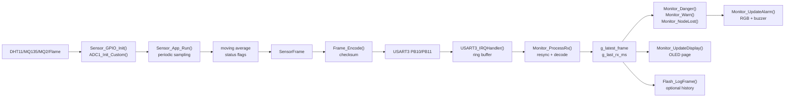

可以这样讲解：

1. 传感器先被 GPIO/ADC 初始化。
2. 板 A 每秒采样一次，并对 MQ 值做轻量滤波。
3. 采样结果放进 `SensorFrame`，再通过固定帧格式编码。
4. USART3 负责双板通信，板 B 用中断收字节，主循环解析帧。
5. 合法帧更新 `g_latest_frame`，同时刷新最后接收时间。
6. OLED、报警、Flash 都只依赖这份最新合法数据，因此模块之间耦合较低。

## 15. 异常与恢复设计

| 异常 | 检测位置 | 恢复/表现方式 |
|---|---|---|
| DHT11 读取失败 | `DHT11_Read()` 返回 0 | 板 A 继续发送帧，并设置 `STATUS_DHT_ERROR`；板 B 进入 warning |
| 串口噪声/错位 | `Frame_Decode()` 校验失败 | 丢弃坏帧，`Monitor_ProcessRx()` 继续寻找下一次 `AA 55` |
| 接收缓冲满 | `USART3_IRQHandler()` | 丢弃最新字节，避免中断阻塞 |
| 板 A 掉线/断线 | `Monitor_NodeLost()` | OLED 显示 `NODE LOST`，蓝灯和慢速蜂鸣 |
| Flash 未接入 | `Flash_Init_Custom()` JEDEC ID 不匹配 | `g_flash_present=0`，主功能继续运行 |
| Flash 写满 4 KB 扇区 | `Flash_LogFrame()` | 回到地址 0，擦除扇区重新记录 |
| 时钟初始化失败 | `SystemClock_Config()` 调用 HAL 配置返回错误 | `Error_Handler()` 关闭中断并停机，避免在错误时钟下继续运行 |
| 断言失败 | `assert_failed()` | 当前保留空实现，后续可扩展为 USART1 打印文件和行号 |

这些设计让演示更稳：即使某个模块失效，系统也尽量保持可观察、可恢复，而不是直接卡死。

## 16. 函数协作总表

| 功能域 | 函数 | 上游调用 | 下游调用/影响 |
|---|---|---|---|
| 启动 | `main()` | 复位入口 | `SystemClock_Config()`、`MX_GPIO_Init()`、`App_Init()`、角色主循环 |
| 启动 | `App_Init()` | `main()` | 公共串口初始化、角色专属初始化 |
| 启动 | `Error_Handler()` | HAL 初始化/时钟配置失败 | 关闭中断并停在死循环 |
| 启动 | `assert_failed()` | HAL full assert 机制 | 断言失败扩展入口 |
| 时钟 | `SystemClock_Config()` | `main()` | 影响 USART、SPI、DWT、HAL tick |
| 调试串口 | `Debug_USART1_Init()` | `App_Init()` | 让 `printf()` 可通过 CH340C 输出 |
| 调试串口 | `__io_putchar()` | `printf()` | `USART_SendByte(USART1)` |
| 双板串口 | `Node_USART3_Init()` | `App_Init()` | 配置 USART3；显示节点开启 RXNE 中断 |
| 双板串口 | `USART3_IRQHandler()` | USART3 RXNE/ORE 中断 | 写入 `g_node_rx_buf` |
| 双板串口 | `USART_ReadByte()` | `Monitor_ProcessRx()` | 从环形缓冲取出字节 |
| 双板串口 | `USART_SendByte()` | `USART_SendBuffer()`、`__io_putchar()` | 发送单字节 |
| 双板串口 | `USART_SendBuffer()` | `Sensor_SendFrame()` | 发送完整帧 |
| 微秒延时 | `Delay_Init()` | `App_Init()` | 启用 DWT |
| 微秒延时 | `Delay_Us()` | DHT11、I2C | 提供微秒时序 |
| 采集 | `Sensor_App_Run()` | `main()` | 周期采样、发送、打印 |
| 采集 | `Sensor_GPIO_Init()` | `App_Init()` | 配置 DHT11/MQ/火焰引脚 |
| 采集 | `ADC1_Init_Custom()` | `App_Init()` | 配置 ADC1 |
| 采集 | `ADC1_ReadChannel()` | `Sensor_App_Run()` | 读取 MQ135/MQ2 |
| DHT11 | `DHT11_SetOutput()` | `DHT11_Read()` | MCU 控制总线 |
| DHT11 | `DHT11_SetInput()` | `DHT11_Read()` | DHT11 控制总线 |
| DHT11 | `DHT11_WaitLevel()` | `DHT11_Read()` | 等待协议电平 |
| DHT11 | `DHT11_Read()` | `Sensor_App_Run()` | 输出温湿度和状态 |
| 协议 | `Frame_Checksum()` | `Frame_Encode()`、`Frame_Decode()` | 生成/验证校验和 |
| 协议 | `Frame_Encode()` | `Sensor_SendFrame()` | 结构体转字节帧 |
| 协议 | `Frame_Decode()` | `Monitor_ProcessRx()` | 字节帧转结构体 |
| 协议 | `Sensor_SendFrame()` | `Sensor_App_Run()` | USART3 发帧 |
| 显示节点 | `Monitor_App_Run()` | `main()` | 调度接收、按键、报警、显示、记录 |
| 显示节点 | `Monitor_GPIO_Init()` | `App_Init()` | 配置蜂鸣器、OLED GPIO、初始 LED |
| 接收解析 | `Monitor_ProcessRx()` | `Monitor_App_Run()` | 更新 `g_latest_frame` 和 `g_last_rx_ms` |
| 按键 | `Monitor_UpdateButtons()` | `Monitor_App_Run()` | 更新页面、静音时间、阈值档位 |
| 状态判断 | `Monitor_NodeLost()` | 报警、显示、记录 | 判断通信离线 |
| 状态判断 | `Monitor_Danger()` | 报警、显示、记录 | 判断危险 |
| 状态判断 | `Monitor_Warn()` | 报警、显示、记录 | 判断预警 |
| 报警输出 | `Monitor_UpdateAlarm()` | `Monitor_App_Run()` | 调用 `LED_Set()`、`Buzzer_Set()` |
| 报警输出 | `LED_Set()` | 报警/GPIO 初始化 | 控制 RGB |
| 报警输出 | `Buzzer_Set()` | 报警/GPIO 初始化 | 控制蜂鸣器 |
| OLED | `Monitor_UpdateDisplay()` | `Monitor_App_Run()` | 组织页面文本 |
| OLED | `OLED_Init_Custom()` | `App_Init()` | 初始化 SSD1306 |
| OLED | `OLED_Clear()` | `Monitor_UpdateDisplay()`、`App_Init()` | 清屏 |
| OLED | `OLED_SetCursor()` | `OLED_Clear()`、`OLED_PrintLine()` | 设置页和列 |
| OLED | `OLED_PrintLine()` | `Monitor_UpdateDisplay()` | 打印一行 |
| OLED | `OLED_Puts()` | `OLED_PrintLine()` | 打印字符串 |
| OLED | `OLED_PutChar()` | `OLED_Puts()` | 打印单字符 |
| OLED | `Font5x7()` | `OLED_PutChar()` | ASCII 转点阵 |
| OLED | `OLED_Cmd()`、`OLED_Data()`、`OLED_Write()` | OLED 上层函数 | 发送 OLED 命令/数据 |
| 软件 I2C | `I2C_Start()`、`I2C_Stop()`、`I2C_WriteByte()` | `OLED_Write()` | 模拟 I2C 总线 |
| 软件 I2C | `I2C_SDA()`、`I2C_SCL()`、`I2C_Delay()` | I2C 上层函数 | GPIO 电平和时序 |
| Flash | `Flash_Init_Custom()` | `App_Init()` | 检测 W25Q64 是否存在 |
| Flash | `Flash_LogFrame()` | `Monitor_App_Run()` | 写入采集记录 |
| Flash | `Flash_CS()`、`SPI2_TxRx()` | Flash 驱动函数 | SPI 底层通信 |
| Flash | `Flash_ReadStatus()`、`Flash_WaitReady()` | 擦除/写入 | 等待 Flash 空闲 |
| Flash | `Flash_WriteEnable()` | 擦除/写入 | 开启写操作 |
| Flash | `Flash_SectorErase()` | 初始化/循环写满 | 擦除 4 KB 扇区 |
| Flash | `Flash_PageProgram()` | `Flash_LogFrame()` | 写入记录 |

## 17. 答辩讲解建议

可以按下面的 5 分钟节奏讲：

1. 先展示总体架构图：两块 STM32，一块采集，一块显示报警，USART3 连接。
2. 讲为什么保留 USART1：PA9/PA10 默认接 CH340C，用来双串口调试。
3. 讲板 A 采集链路：DHT11 单总线、MQ ADC、火焰 DO、滑动平均、数据帧。
4. 讲板 B 处理链路：中断环形缓冲、帧头同步、checksum、OLED/报警/按键。
5. 讲鲁棒性：DHT11 错误标志、坏帧丢弃、节点离线、Flash 可选不影响主流程。

最后收束到一句话：本项目不是单片机点灯拼模块，而是一个有节点分工、有通信协议、有状态机、有异常处理的双 MCU 环境安全监测系统。
