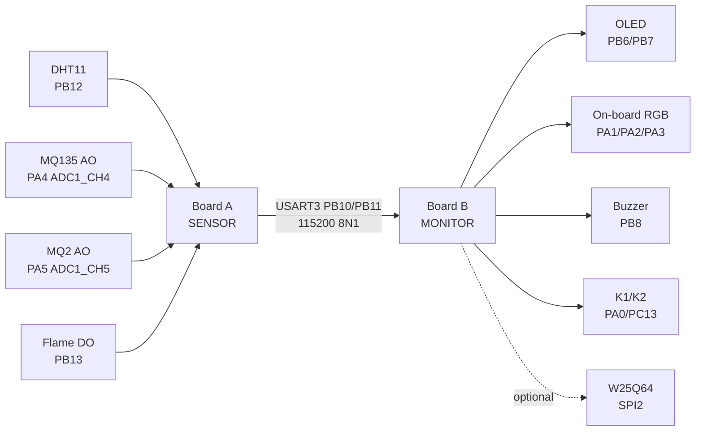

# dual-stm32-safety-monitor

> A two-node STM32F103C8T6 environmental safety monitor: one board samples sensors, the other displays data and raises local alarms.

[English](README.md) | [简体中文](README.zh-CN.md)


## Overview

This repository contains a course-ready embedded final project built around two Wildfire STM32F103C8T6 dual-USB core boards.

The project avoids ESP8266/Wi-Fi and instead demonstrates a clean dual-MCU architecture:

- **Board A: SENSOR node**  
  Samples DHT11, MQ135, MQ2, and flame sensor data.

- **Board B: MONITOR node**  
  Receives frames over USART3, updates an OLED UI, drives RGB/buzzer alarms, handles keys, and optionally logs history to W25Q64.



## Highlights

- One codebase builds into two firmware images through `APP_NODE_ROLE`.
- USART1 `PA9/PA10` stays reserved for the on-board CH340C USB-to-UART debug channel.
- USART3 `PB10/PB11` is used for direct board-to-board communication.
- Monitor-side USART3 reception uses an interrupt ring buffer to avoid losing bytes during OLED refresh.
- Lightweight frame protocol with header, payload length, sequence number, status byte, and checksum.
- OLED UI, RGB status light, buzzer alarm, button interaction, node-lost detection, and optional W25Q64 log records.
- `.ioc` is updated to match the firmware pin map as closely as a single dual-role CubeMX file can.

## Hardware

Target board:

- Wildfire STM32F103C8T6 dual-USB core board
- MCU: STM32F103C8T6
- Clock: 8 MHz HSE, 72 MHz SYSCLK

Core module list:

| Role | Module | Pin |
|---|---|---|
| SENSOR | DHT11 DATA | `PB12` |
| SENSOR | MQ135 AO | `PA4 / ADC1_CH4` |
| SENSOR | MQ2 AO | `PA5 / ADC1_CH5` |
| SENSOR | Flame DO | `PB13`, active-low |
| MONITOR | OLED SCL/SDA | `PB6 / PB7`, software I2C |
| MONITOR | RGB LED | `PA1 / PA2 / PA3`, active-low |
| MONITOR | Buzzer | `PB8`, active-high |
| MONITOR | K1/K2 | `PA0 / PC13` |
| Optional | W25Q64 | `PB12 CS`, `PB13 SCK`, `PB14 MISO`, `PB15 MOSI` |

Full wiring notes are in [WIRING.md](WIRING.md).

## Documentation

- [WIRING.md](WIRING.md): hardware wiring guide.
- [FUNCTION_GUIDE.md](FUNCTION_GUIDE.md): bilingual beginner guide to the main firmware functions.
- [PROJECT_STRUCTURE.md](PROJECT_STRUCTURE.md): bilingual repository layout and modification guide.

## Firmware Images

The same source file, [Core/Src/main.c](Core/Src/main.c), is compiled into two images:

| Preset | Output | Burn to |
|---|---|---|
| `SensorDebug` | `build/SensorDebug/Fire_F103_sensor.hex` | Board A |
| `MonitorDebug` | `build/MonitorDebug/Fire_F103_monitor.hex` | Board B |

## Build

Requirements:

- CMake
- Ninja
- `arm-none-eabi-gcc`
- STM32CubeCLT or an equivalent ARM GCC toolchain

Build both nodes:

```powershell
cmake --preset SensorDebug
cmake --build --preset SensorDebug

cmake --preset MonitorDebug
cmake --build --preset MonitorDebug
```

## Frame Protocol

Board A sends one 13-byte frame per second:

```text
AA 55 LEN TEMP HUMI MQ135_H MQ135_L MQ2_H MQ2_L FLAME SEQ STATUS CHECKSUM
```

Fields:

| Field | Meaning |
|---|---|
| `AA 55` | Frame header |
| `LEN` | Payload length, fixed to `9` |
| `TEMP/HUMI` | DHT11 temperature and humidity |
| `MQ135_H/L` | 12-bit ADC reading split into high/low bytes |
| `MQ2_H/L` | 12-bit ADC reading split into high/low bytes |
| `FLAME` | `1` if flame is detected |
| `SEQ` | Rolling frame sequence number |
| `STATUS` | `bit0 = DHT11 read error` |
| `CHECKSUM` | Low 8 bits of `LEN + payload bytes` |

## Alarm Logic

| State | Condition | Output |
|---|---|---|
| Normal | No warning or danger | Green LED |
| Warning | Air/smoke warning threshold or DHT11 error | Yellow LED |
| Danger | Flame detected or smoke danger threshold | Red LED + fast buzzer |
| Node lost | No valid sensor frame for 3 seconds | Blue LED + slow buzzer |

K1 switches OLED pages.  
K2 short press mutes the buzzer for 60 seconds.  
K2 long press cycles threshold profiles.

## Repository Layout

```text
.
├── Core/                    Application and generated STM32 source
├── Drivers/                 CMSIS and STM32F1 HAL drivers
├── cmake/                   Toolchain and CubeMX CMake glue
├── MDK-ARM/                 Keil uVision project files
├── Fire_F103.ioc            CubeMX pin/peripheral reference
├── CMakeLists.txt           Top-level firmware build script
├── CMakePresets.json        Sensor/monitor build presets
├── WIRING.md                Hardware wiring guide
├── FUNCTION_GUIDE.md        Bilingual beginner function guide
├── PROJECT_STRUCTURE.md     Bilingual repository structure guide
├── README.md                This file
├── README.zh-CN.md          Chinese README
└── assets/                  Local notes/images, intentionally ignored
```

## Demo Checklist

1. Burn `Fire_F103_sensor.hex` to Board A.
2. Burn `Fire_F103_monitor.hex` to Board B.
3. Connect USART3 cross-wires and common GND.
4. Open both CH340C serial ports at `115200 8N1`.
5. Confirm Board A prints `[SENSOR]` every second.
6. Confirm Board B prints `[MONITOR] rx` and updates OLED.
7. Disconnect the USART3 link and wait for `NODE LOST`.
8. Trigger smoke/flame sensor changes and watch alarm state transitions.

## Notes

- MQ sensor values are raw ADC readings and need calibration for real ppm measurement.
