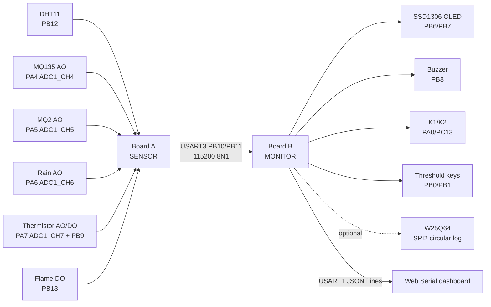

# dual-stm32-safety-monitor

> Dual-node STM32F103C8T6 environmental safety monitor: Board A samples sensors, Board B evaluates alarms, shows status, logs history, and streams JSON Lines for the browser dashboard.

[English](README.md) | [Chinese](README.zh-CN.md)


## Overview

This repository is the CLion + CMake workflow for a portable dual-board STM32F103C8T6 safety monitor. The current backend is split into a SENSOR image and a MONITOR image by `APP_NODE_ROLE`.

- **Board A: SENSOR node**  
  Samples DHT11, MQ135, MQ2, rain, thermistor, and flame inputs once per second, smooths analog channels, and sends a protocol v2 binary frame over USART3.

- **Board B: MONITOR node**  
  Uses a stream decoder to recover USART3 frames, evaluates warning/danger/node-lost states, refreshes SSD1306 OLED pages, drives the buzzer, handles K1/K2 and external threshold keys, optionally logs fixed records to W25Q64, and prints JSON Lines on USART1.


```mermaid
flowchart LR
  DHT11[DHT11<br/>PB12] --> A[Board A<br/>SENSOR]
  MQ135[MQ135 AO<br/>PA4 ADC1_CH4] --> A
  MQ2[MQ2 AO<br/>PA5 ADC1_CH5] --> A
  Rain[Rain AO<br/>PA6 ADC1_CH6] --> A
  Therm[Thermistor AO/DO<br/>PA7 ADC1_CH7 + PB9] --> A
  Flame[Flame DO<br/>PB13] --> A
  A -- USART3 PB10/PB11<br/>115200 8N1 --> B[Board B<br/>MONITOR]
  B --> OLED[SSD1306 OLED<br/>PB6/PB7]
  B --> Buzz[Buzzer<br/>PB8]
  B --> Keys[K1/K2<br/>PA0/PC13]
  B --> ThresholdKeys[Threshold keys<br/>PB0/PB1]
  B -. optional .-> Flash[W25Q64<br/>SPI2 circular log]
  B -- USART1 JSON Lines --> Web[Web Serial dashboard]
```

## Current Backend Highlights

- `FrameCodec` defines the 22-byte protocol v2 frame; `FrameStreamDecoder` resynchronizes after noise, overlapping headers, and bad checksums.
- `AlarmEvaluator` centralizes alarm priority: danger, waiting, node lost, warning, then normal.
- `DisplayFormatter` builds two OLED pages: live readings and threshold/log status.
- `W25q64FlashLogger` is optional and non-blocking: MONITOR initializes W25Q64 through `MX_SPI2_Init()` and HAL SPI, sector 0 stores cursor metadata, and sector 1 through 8 MB stores 32-byte circular records.
- The monitor prints JSON schema v2 fields for rain, thermistor, per-sensor threshold levels, actual threshold values, mute state, flash presence, and flash record count.
- WS2813/RGB driver files were removed from the current build. Hardware reference pages may still describe those parts as legacy or expansion notes, but they are not active firmware outputs.

## Reference Pin Map

| Role | Module | Pin |
|---|---|---|
| SENSOR | DHT11 DATA | `PB12` |
| SENSOR | MQ135 AO | `PA4 / ADC1_CH4` |
| SENSOR | MQ2 AO | `PA5 / ADC1_CH5` |
| SENSOR | Rain AO/SIG | `PA6 / ADC1_CH6` |
| SENSOR | Thermistor AO | `PA7 / ADC1_CH7` |
| SENSOR | Thermistor DO | `PB9`, active-low high-temperature trigger |
| SENSOR | Flame DO | `PB13`, active-low |
| MONITOR | OLED SCL/SDA | `PB6 / PB7`, software I2C |
| MONITOR | Buzzer | `PB8`, active-high |
| MONITOR | K1/K2 | `PA0 / PC13`, active-high in the reference board wiring |
| MONITOR | External threshold keys | `PB0` selects the sensor, `PB1` changes its five-level threshold; internal pull-up, press to `GND` |
| MONITOR optional | W25Q64 | `PB12 CS`, `PB13 SCK`, `PB14 MISO`, `PB15 MOSI` |
| Both | Board link | USART3 `PB10/PB11`, crossed TX/RX, common GND |
| Both | Debug/JSON UART | USART1 `PA9/PA10`, `115200 8N1` |

Full bilingual wiring notes are in [WIRING.md](WIRING.md). Per-chip and per-module hardware notes start at [docs/hardware/index.en.md](docs/hardware/index.en.md).

## Documentation

- [WIRING.md](WIRING.md): bilingual wiring guide and board-porting checklist.
- [docs/hardware/index.en.md](docs/hardware/index.en.md) / [Chinese](docs/hardware/index.zh-CN.md): per-chip and per-module hardware references.
- [docs/BOARD_AND_CHIP_REFERENCE.en.md](docs/BOARD_AND_CHIP_REFERENCE.en.md) / [Chinese](docs/BOARD_AND_CHIP_REFERENCE.zh-CN.md): hardware index and board-level summary.
- [docs/MODULE_REFERENCE.en.md](docs/MODULE_REFERENCE.en.md) / [Chinese](docs/MODULE_REFERENCE.zh-CN.md): module index and signal summary.
- [docs/CLION_CMAKE_GUIDE.en.md](docs/CLION_CMAKE_GUIDE.en.md) / [Chinese](docs/CLION_CMAKE_GUIDE.zh-CN.md): CLion + CMake Presets workflow.
- [docs/FRONTEND_SERIAL_DASHBOARD.en.md](docs/FRONTEND_SERIAL_DASHBOARD.en.md) / [Chinese](docs/FRONTEND_SERIAL_DASHBOARD.zh-CN.md): Web Serial dashboard guide.
- [docs/FUNCTION_GUIDE.en.md](docs/FUNCTION_GUIDE.en.md) / [Chinese](docs/FUNCTION_GUIDE.zh-CN.md): function-level reading guide.
- [docs/FUNCTION_DESIGN_WALKTHROUGH.en.md](docs/FUNCTION_DESIGN_WALKTHROUGH.en.md) / [Chinese](docs/FUNCTION_DESIGN_WALKTHROUGH.zh-CN.md): firmware design walkthrough.
- [docs/PROJECT_STRUCTURE.en.md](docs/PROJECT_STRUCTURE.en.md) / [Chinese](docs/PROJECT_STRUCTURE.zh-CN.md): repository layout and edit guide.

## Build

The primary workflow is CLion + CMake Presets + Ninja + ARM GCC.

```powershell
cmake --preset SensorDebug
cmake --build --preset SensorDebug

cmake --preset MonitorDebug
cmake --build --preset MonitorDebug
```

| Preset | Output | Burn to |
|---|---|---|
| `SensorDebug` | `build/SensorDebug/Env-Monitor_sensor.hex` | Board A |
| `MonitorDebug` | `build/MonitorDebug/Env-Monitor_monitor.hex` | Board B |

Release images are also available through `SensorRelease` and `MonitorRelease`.

## Web Serial Dashboard

Board B emits machine-readable JSON Lines on USART1. Start the Vite frontend from the repository root:

```powershell
npm --prefix frontend install
npm --prefix frontend run dev
```

Open `http://localhost:5173` in Chrome or Edge, connect to Board B's USB-UART serial port at `115200 8N1`, or use replay mode without hardware. The dashboard supports Chinese/English switching for the UI, parser errors, AI/local-rule analysis, and event log labels.

## Frame Protocol

Board A sends one 22-byte v2 frame per second.

```text
AA 55 LEN VER TEMP HUMI MQ135 MQ2 RAIN THERM_ADC THERM_C10 FLAME RAIN_WET THERM_HOT SEQ STATUS CHECKSUM
```

| Field | Meaning |
|---|---|
| `LEN` | Payload length, v2 fixed to `18` |
| `VER` | Protocol version, fixed to `2` |
| `THERM_C10` | Thermistor temperature in 0.1 deg C |
| `STATUS` | `bit0=DHT error`, `bit1=thermistor DO hot`, `bit2=rain wet`, `bit3=thermistor ADC fault` |
| `CHECKSUM` | Low 8 bits of `LEN + payload bytes` |

The monitor converts accepted frames into JSON schema v2. The current required v2 extension fields are `rainRaw`, `thermRaw`, `thermC10`, `rainWet`, `thermHot`, and `flashRecords`. New firmware also prints `selectedThresholdSensor`, four `threshold*Level` fields, and six actual threshold fields; when old logs do not include them, the dashboard falls back to `thresholdProfile`. The firmware may also print `externalRgb` as a legacy placeholder; the dashboard must not treat it as a required active output.

## Demo Checklist

1. Burn the SENSOR image to Board A and the MONITOR image to Board B.
2. Cross USART3 TX/RX and connect common GND.
3. Open Board B debug serial at `115200 8N1`; open Board A debug serial if available.
4. Confirm Board B prints `[MONITOR] ... flash=ok` or `flash=none`, then `[MONITOR] rx v2` and JSON Lines.
5. Wire the external threshold keys to `PB0/PB1` and `GND`, then verify PB0 cycles MQ135/MQ2/rain/thermistor and PB1 cycles five threshold levels.
6. Validate `normal`, `warn`, `danger`, and frontend stale/node-lost behavior on OLED, buzzer, dashboard status, and W25Q64 record count.

## Notes

- MQ values are raw ADC counts and need site calibration for ppm-like interpretation.
- All ADC inputs must stay within 0 to VDDA.
- W25Q64 is optional; when absent, monitoring, OLED, buzzer, and JSON output still work.
