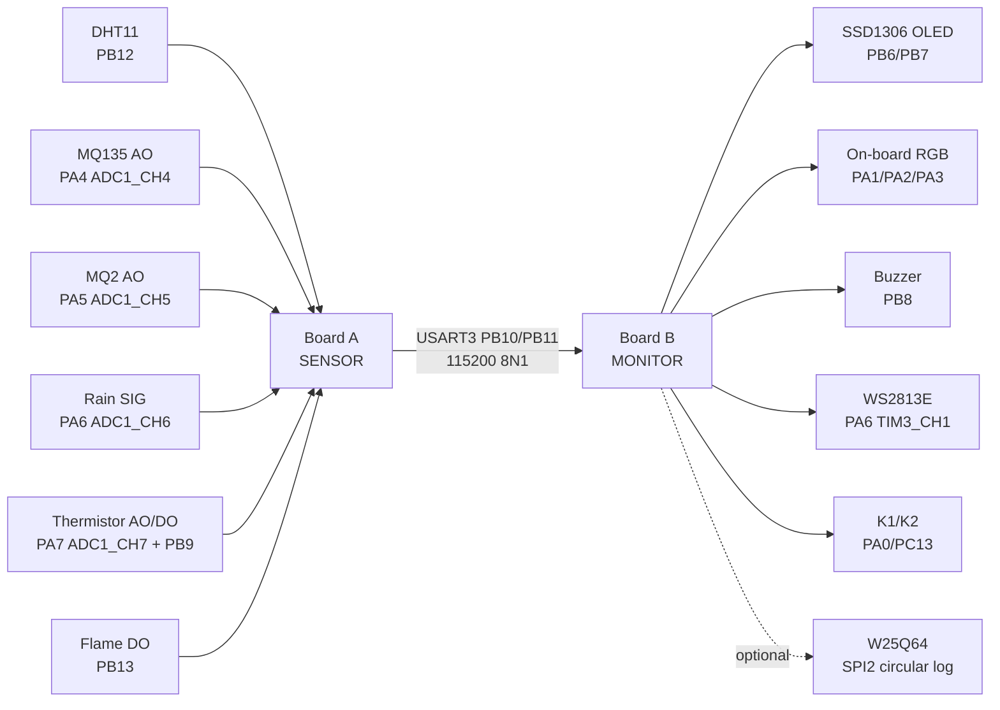

# dual-stm32-safety-monitor

> A generic dual-node STM32F103C8T6 environmental safety monitor reference design: one MCU samples sensors, the other displays data, raises alarms, logs history, and streams JSON Lines.

[English](README.md) | [简体中文](README.zh-CN.md)


## Overview

This repository is a portable STM32F103C8T6 dual-board reference implementation. It is not tied to a specific vendor board: the documented pins are the current reference pin map, and the hardware docs explain what to check when moving to another STM32F103C8T6 board.

- **Board A: SENSOR node**  
  Samples DHT11, MQ135, MQ2, rain, thermistor, and flame inputs, then sends a v2 binary frame over USART3.

- **Board B: MONITOR node**  
  Receives USART3 frames, updates SSD1306 OLED pages, drives on-board RGB, external WS2813E RGB, and buzzer alarms, handles keys, logs to W25Q64, and prints JSON Lines over USART1.


```mermaid
flowchart LR
  DHT11[DHT11<br/>PB12] --> A[Board A<br/>SENSOR]
  MQ135[MQ135 AO<br/>PA4 ADC1_CH4] --> A
  MQ2[MQ2 AO<br/>PA5 ADC1_CH5] --> A
  Rain[Rain SIG<br/>PA6 ADC1_CH6] --> A
  Therm[Thermistor AO/DO<br/>PA7 ADC1_CH7 + PB9] --> A
  Flame[Flame DO<br/>PB13] --> A
  A -- USART3 PB10/PB11<br/>115200 8N1 --> B[Board B<br/>MONITOR]
  B --> OLED[SSD1306 OLED<br/>PB6/PB7]
  B --> RGB[On-board RGB<br/>PA1/PA2/PA3]
  B --> Buzz[Buzzer<br/>PB8]
  B --> ExtRGB[WS2813E<br/>PA6 TIM3_CH1]
  B --> Keys[K1/K2<br/>PA0/PC13]
  B -. optional .-> Flash[W25Q64<br/>SPI2 circular log]
```

## Highlights

- One source tree builds two firmware images through `APP_NODE_ROLE`.
- USART3 `PB10/PB11` is the direct board-to-board data link.
- USART1 `PA9/PA10` is the debug/JSON output channel when the target board has a USB-UART bridge.
- Protocol v2 carries DHT11, MQ135, MQ2, rain, thermistor, flame, status bits, and checksum.
- Board B outputs browser-friendly JSON Lines while retaining human-readable logs.
- W25Q64 uses sector 0 metadata and sector 1 through 8 MB as fixed 32-byte circular records.
- WS2813E uses `PA6/TIM3_CH1` PWM + DMA, GRB order, default one LED.

## Reference Pin Map

| Role | Module | Pin |
|---|---|---|
| SENSOR | DHT11 DATA | `PB12` |
| SENSOR | MQ135 AO | `PA4 / ADC1_CH4` |
| SENSOR | MQ2 AO | `PA5 / ADC1_CH5` |
| SENSOR | Rain SIG | `PA6 / ADC1_CH6` |
| SENSOR | Thermistor AO | `PA7 / ADC1_CH7` |
| SENSOR | Thermistor DO | `PB9`, active-low high-temperature trigger |
| SENSOR | Flame DO | `PB13`, active-low |
| MONITOR | OLED SCL/SDA | `PB6 / PB7`, software I2C |
| MONITOR | On-board RGB LED | `PA1 / PA2 / PA3`, active-low in the reference board wiring |
| MONITOR | External WS2813E RGB | `PA6 / TIM3_CH1` |
| MONITOR | Buzzer | `PB8`, active-high |
| MONITOR | K1/K2 | `PA0 / PC13` |
| MONITOR optional | W25Q64 | `PB12 CS`, `PB13 SCK`, `PB14 MISO`, `PB15 MOSI` |

Full wiring notes are in [WIRING.md](WIRING.md). Per-chip and per-module hardware notes start at [docs/hardware/index.en.md](docs/hardware/index.en.md).

## Documentation

- [WIRING.md](WIRING.md): generic wiring guide and board-porting checklist.
- [docs/hardware/index.en.md](docs/hardware/index.en.md) / [中文](docs/hardware/index.zh-CN.md): per-chip and per-module hardware references.
- [docs/BOARD_AND_CHIP_REFERENCE.en.md](docs/BOARD_AND_CHIP_REFERENCE.en.md) / [中文](docs/BOARD_AND_CHIP_REFERENCE.zh-CN.md): hardware index and board-level summary.
- [docs/MODULE_REFERENCE.en.md](docs/MODULE_REFERENCE.en.md) / [中文](docs/MODULE_REFERENCE.zh-CN.md): module index and signal summary.
- [docs/CLION_CMAKE_GUIDE.en.md](docs/CLION_CMAKE_GUIDE.en.md) / [中文](docs/CLION_CMAKE_GUIDE.zh-CN.md): CLion + CMake Presets workflow.
- [docs/FRONTEND_SERIAL_DASHBOARD.en.md](docs/FRONTEND_SERIAL_DASHBOARD.en.md) / [中文](docs/FRONTEND_SERIAL_DASHBOARD.zh-CN.md): Web Serial dashboard guide.
- [docs/FUNCTION_DESIGN_WALKTHROUGH.en.md](docs/FUNCTION_DESIGN_WALKTHROUGH.en.md) / [中文](docs/FUNCTION_DESIGN_WALKTHROUGH.zh-CN.md): firmware design walkthrough.
- [docs/PROJECT_STRUCTURE.md](docs/PROJECT_STRUCTURE.md): repository layout and edit guide.

## Build

The primary workflow is CLion + CMake Presets + Ninja + ARM GCC.

```powershell
cmake --preset SensorDebug
cmake --build --preset SensorDebug

cmake --preset MonitorDebug
cmake --build --preset MonitorDebug
```

| Preset | Output | Burn to |
|---|---|---|
| `SensorDebug` | `build/SensorDebug/Env-Monitor_sensor.hex` | Board A |
| `MonitorDebug` | `build/MonitorDebug/Env-Monitor_monitor.hex` | Board B |

`Env-Monitor.*` names are the current firmware artifact names; they are not a hardware-vendor requirement.

## Web Serial Dashboard

Board B emits machine-readable JSON Lines on USART1. Start the static frontend from the repository root:

```powershell
python -m http.server 5173 -d frontend
```

Open `http://localhost:5173` in Chrome or Edge, connect to Board B's USB-UART serial port at `115200 8N1`, or use replay mode without hardware.

## Frame Protocol

Board A sends one 22-byte v2 frame per second. MQ, rain, thermistor, and flame values refresh every frame; DHT11 refreshes at a safe interval and skipped frames reuse the latest valid temperature/humidity.

```text
AA 55 LEN VER TEMP HUMI MQ135 MQ2 RAIN THERM THERM_C10 FLAME RAIN_WET THERM_HOT SEQ STATUS CHECKSUM
```

| Field | Meaning |
|---|---|
| `LEN` | Payload length, v2 fixed to `18` |
| `VER` | Protocol version, fixed to `2` |
| `THERM_C10` | Thermistor temperature in 0.1 deg C |
| `STATUS` | `bit0=DHT error`, `bit1=thermistor DO hot`, `bit2=rain wet`, `bit3=thermistor ADC fault` |
| `CHECKSUM` | Low 8 bits of `LEN + payload bytes` |

## Demo Checklist

1. Burn the SENSOR image to Board A and the MONITOR image to Board B.
2. Cross USART3 TX/RX and connect common GND.
3. Open both debug serial ports at `115200 8N1`.
4. Confirm Board B prints `[MONITOR] rx v2` and JSON Lines.
5. Validate normal, warning, danger, and node-lost behavior on OLED, buzzer, RGB, external RGB, and W25Q64 log count.

## Notes

- MQ values are raw ADC counts and need site calibration for ppm-like interpretation.
- All ADC inputs must stay within 0 to VDDA.
- WS2813E uses 5 V LED power; add data level shifting from 3.3 V to 5 V when possible.
