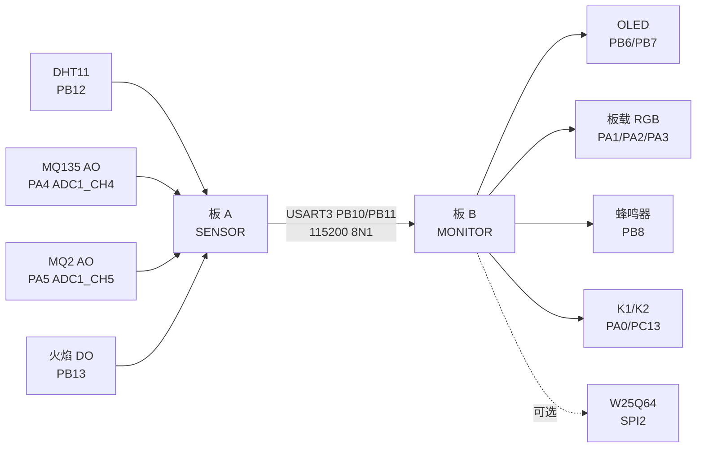

# 双 STM32F103C8T6 环境安全监测系统

> 一个面向嵌入式期末大作业的双节点环境安全监测项目：一块板负责传感器采集，另一块板负责 OLED 显示、按键交互和本地报警。

[English](README.md) | [简体中文](README.zh-CN.md)


## 项目简介

本项目基于两块野火 STM32F103C8T6 双 USB 核心板，不依赖 ESP8266 或 Wi-Fi，而是用两块 STM32 组成一个分布式监测系统。

- **板 A：SENSOR 采集节点**  
  负责读取 DHT11、MQ135、MQ2 和火焰传感器，并通过 USART3 周期性上报数据帧。

- **板 B：MONITOR 显示报警节点**  
  负责接收板 A 数据，刷新 OLED，控制板载 RGB 灯和蜂鸣器，并处理 K1/K2 按键交互；可选接入 W25Q64 做历史记录。



## 项目亮点

- 同一套源码通过 `APP_NODE_ROLE` 编译出采集节点和显示节点两个固件。
- 保留 `PA9/PA10` 给板载 CH340C USB 转串口，用作调试日志和串口下载通道。
- 两块 STM32 之间使用 `USART3 PB10/PB11` 直连通信，体现多 MCU 协作。
- 板 B 使用 USART3 中断接收环形缓冲，OLED 刷新时也不容易丢帧。
- 自定义轻量数据帧：帧头、长度、序号、状态位和 checksum 校验。
- 支持 OLED 页面、RGB 状态灯、蜂鸣器报警、按键静音、节点离线检测和可选 W25Q64 记录。
- `Fire_F103.ioc` 已尽量同步当前固件的引脚和外设配置，方便用 CubeMX 查看。

## 硬件资源

目标核心板：

- 野火 STM32F103C8T6 双 USB 核心板
- MCU：STM32F103C8T6
- 时钟：8 MHz HSE，72 MHz SYSCLK

核心模块分配：

| 节点 | 模块 | 引脚 |
|---|---|---|
| SENSOR | DHT11 DATA | `PB12` |
| SENSOR | MQ135 AO | `PA4 / ADC1_CH4` |
| SENSOR | MQ2 AO | `PA5 / ADC1_CH5` |
| SENSOR | 火焰 DO | `PB13`，低电平有效 |
| MONITOR | OLED SCL/SDA | `PB6 / PB7`，软件 I2C |
| MONITOR | 板载 RGB LED | `PA1 / PA2 / PA3`，低电平点亮 |
| MONITOR | 蜂鸣器 | `PB8`，高电平响 |
| MONITOR | K1/K2 | `PA0 / PC13` |
| 可选 | W25Q64 | `PB12 CS`，`PB13 SCK`，`PB14 MISO`，`PB15 MOSI` |

详细接线请看 [WIRING.md](WIRING.md)。

## 配套文档

- [WIRING.md](WIRING.md)：硬件接线说明。
- [FUNCTION_GUIDE.md](FUNCTION_GUIDE.md)：面向初学者的中英双语函数说明。
- [PROJECT_STRUCTURE.md](PROJECT_STRUCTURE.md)：中英双语项目结构和修改入口说明。

## 固件镜像

同一个源码入口 [Core/Src/main.c](Core/Src/main.c) 会编译出两个不同固件：

| CMake Preset | 输出文件 | 烧录到 |
|---|---|---|
| `SensorDebug` | `build/SensorDebug/Fire_F103_sensor.hex` | 板 A |
| `MonitorDebug` | `build/MonitorDebug/Fire_F103_monitor.hex` | 板 B |

## 构建方法

需要安装：

- CMake
- Ninja
- `arm-none-eabi-gcc`
- STM32CubeCLT 或等价 ARM GCC 工具链

在仓库根目录执行：

```powershell
cmake --preset SensorDebug
cmake --build --preset SensorDebug

cmake --preset MonitorDebug
cmake --build --preset MonitorDebug
```

## 通信协议

板 A 每秒发送一帧 13 字节数据：

```text
AA 55 LEN TEMP HUMI MQ135_H MQ135_L MQ2_H MQ2_L FLAME SEQ STATUS CHECKSUM
```

字段说明：

| 字段 | 含义 |
|---|---|
| `AA 55` | 帧头 |
| `LEN` | 负载长度，固定为 `9` |
| `TEMP/HUMI` | DHT11 温度和湿度 |
| `MQ135_H/L` | MQ135 的 12 位 ADC 值，高低字节拆分 |
| `MQ2_H/L` | MQ2 的 12 位 ADC 值，高低字节拆分 |
| `FLAME` | `1` 表示检测到火焰 |
| `SEQ` | 循环递增的帧序号 |
| `STATUS` | `bit0 = DHT11 读取错误` |
| `CHECKSUM` | `LEN + payload bytes` 的低 8 位 |

## 报警逻辑

| 状态 | 触发条件 | 输出 |
|---|---|---|
| 正常 | 无警告、无危险 | 绿灯 |
| 警告 | 空气/烟雾达到预警阈值，或 DHT11 读取异常 | 黄灯 |
| 危险 | 检测到火焰，或烟雾严重超标 | 红灯 + 快速蜂鸣 |
| 节点丢失 | 超过 3 秒没有收到有效采集帧 | 蓝灯 + 慢速蜂鸣 |

K1 用于切换 OLED 页面。  
K2 短按静音蜂鸣器 60 秒。  
K2 长按切换阈值档位。

## 仓库结构

```text
.
├── Core/                    应用层和 STM32 生成源码
├── Drivers/                 CMSIS 与 STM32F1 HAL 驱动
├── cmake/                   工具链和 CubeMX CMake 配置
├── MDK-ARM/                 Keil uVision 工程文件
├── Fire_F103.ioc            CubeMX 引脚/外设参考配置
├── CMakeLists.txt           顶层固件构建脚本
├── CMakePresets.json        SENSOR/MONITOR 构建预设
├── WIRING.md                硬件接线说明
├── FUNCTION_GUIDE.md        中英双语函数说明
├── PROJECT_STRUCTURE.md     中英双语项目结构说明
├── README.md                英文原始说明
├── README.zh-CN.md          中文说明
└── assets/                  本地资料/图片，已在 .gitignore 中忽略
```

## 部署步骤

1. 将 `Fire_F103_sensor.hex` 烧录到板 A。
2. 将 `Fire_F103_monitor.hex` 烧录到板 B。
3. 连接两块板的 USART3 交叉线，并保证 GND 共地。
4. 打开两个 CH340C 串口，波特率均为 `115200 8N1`。
5. 确认板 A 每秒打印一次 `[SENSOR]` 采样日志。
6. 确认板 B 打印 `[MONITOR] rx` 并刷新 OLED。
7. 断开 USART3 通信线，等待 OLED 显示 `NODE LOST`。
8. 用烟雾/酒精/火焰源触发传感器，观察 OLED、RGB 灯和蜂鸣器状态变化。

## 注意事项

- MQ 传感器当前使用原始 ADC 值，若要得到 ppm 需要单独标定。
