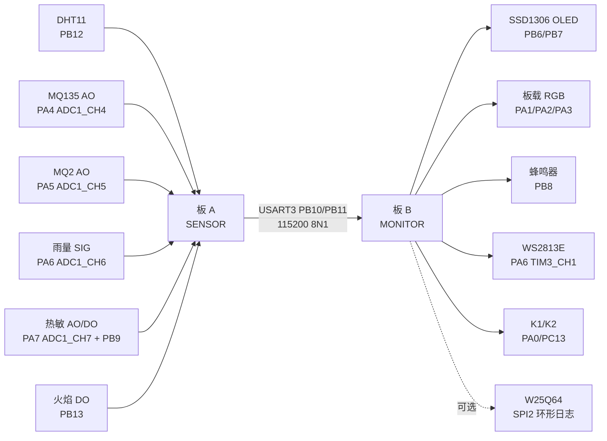

# dual-stm32-safety-monitor

> 通用双节点 STM32F103C8T6 环境安全监测参考设计：一块 MCU 采集传感器，另一块 MCU 显示、报警、记录历史并输出 JSON Lines。

[English](README.md) | [简体中文](README.zh-CN.md)


## 项目简介

本仓库是可移植的 STM32F103C8T6 双板参考实现。它不绑定某个厂商开发板：文档中的引脚是当前参考实现映射，硬件资料会说明迁移到其他 STM32F103C8T6 板卡时需要检查什么。

- **板 A：SENSOR 采集节点**  
  采集 DHT11、MQ135、MQ2、雨量、热敏电阻和火焰输入，并通过 USART3 发送 v2 二进制帧。

- **板 B：MONITOR 显示报警节点**  
  接收 USART3 帧，刷新 SSD1306 OLED，驱动板载 RGB、外置 WS2813E RGB 和蜂鸣器，处理按键，记录 W25Q64，并通过 USART1 输出 JSON Lines。


```mermaid
flowchart LR
  DHT11[DHT11<br/>PB12] --> A[板 A<br/>SENSOR]
  MQ135[MQ135 AO<br/>PA4 ADC1_CH4] --> A
  MQ2[MQ2 AO<br/>PA5 ADC1_CH5] --> A
  Rain[雨量 SIG<br/>PA6 ADC1_CH6] --> A
  Therm[热敏 AO/DO<br/>PA7 ADC1_CH7 + PB9] --> A
  Flame[火焰 DO<br/>PB13] --> A
  A -- USART3 PB10/PB11<br/>115200 8N1 --> B[板 B<br/>MONITOR]
  B --> OLED[SSD1306 OLED<br/>PB6/PB7]
  B --> RGB[板载 RGB<br/>PA1/PA2/PA3]
  B --> Buzz[蜂鸣器<br/>PB8]
  B --> ExtRGB[WS2813E<br/>PA6 TIM3_CH1]
  B --> Keys[K1/K2<br/>PA0/PC13]
  B -. 可选 .-> Flash[W25Q64<br/>SPI2 环形日志]
```

## 项目亮点

- 同一套源码通过 `APP_NODE_ROLE` 编译出两个固件。
- USART3 `PB10/PB11` 是双板直连通信链路。
- 当目标板带 USB 转串口时，USART1 `PA9/PA10` 用作调试和 JSON 输出。
- 协议 v2 包含 DHT11、MQ135、MQ2、雨量、热敏、火焰、状态位和 checksum。
- 板 B 保留人工可读日志，同时输出浏览器可解析的 JSON Lines。
- W25Q64 使用 sector 0 元数据，sector 1 到 8 MB 末尾保存 32 字节固定环形记录。
- WS2813E 使用 `PA6/TIM3_CH1` PWM + DMA，GRB 顺序，默认 1 颗灯。

## 参考引脚映射

| 角色 | 模块 | 引脚 |
|---|---|---|
| SENSOR | DHT11 DATA | `PB12` |
| SENSOR | MQ135 AO | `PA4 / ADC1_CH4` |
| SENSOR | MQ2 AO | `PA5 / ADC1_CH5` |
| SENSOR | 雨量 SIG | `PA6 / ADC1_CH6` |
| SENSOR | 热敏 AO | `PA7 / ADC1_CH7` |
| SENSOR | 热敏 DO | `PB9`，低电平高温触发 |
| SENSOR | 火焰 DO | `PB13`，低电平有效 |
| MONITOR | OLED SCL/SDA | `PB6 / PB7`，软件 I2C |
| MONITOR | 板载 RGB LED | `PA1 / PA2 / PA3`，参考板接法为低电平点亮 |
| MONITOR | 外置 WS2813E RGB | `PA6 / TIM3_CH1` |
| MONITOR | 蜂鸣器 | `PB8`，高电平响 |
| MONITOR | K1/K2 | `PA0 / PC13` |
| MONITOR 可选 | W25Q64 | `PB12 CS`，`PB13 SCK`，`PB14 MISO`，`PB15 MOSI` |

完整接线见 [WIRING.md](WIRING.md)。芯片和模块独立说明从 [docs/hardware/index.zh-CN.md](docs/hardware/index.zh-CN.md) 进入。

## 配套文档

- [WIRING.md](WIRING.md)：通用接线说明和板卡移植检查表。
- [docs/hardware/index.zh-CN.md](docs/hardware/index.zh-CN.md) / [English](docs/hardware/index.en.md)：每个芯片和模块的独立硬件资料。
- [docs/BOARD_AND_CHIP_REFERENCE.zh-CN.md](docs/BOARD_AND_CHIP_REFERENCE.zh-CN.md) / [English](docs/BOARD_AND_CHIP_REFERENCE.en.md)：硬件索引和板级总览。
- [docs/MODULE_REFERENCE.zh-CN.md](docs/MODULE_REFERENCE.zh-CN.md) / [English](docs/MODULE_REFERENCE.en.md)：模块索引和信号总览。
- [docs/CLION_CMAKE_GUIDE.zh-CN.md](docs/CLION_CMAKE_GUIDE.zh-CN.md) / [English](docs/CLION_CMAKE_GUIDE.en.md)：CLion + CMake Presets 工作流。
- [docs/FRONTEND_SERIAL_DASHBOARD.zh-CN.md](docs/FRONTEND_SERIAL_DASHBOARD.zh-CN.md) / [English](docs/FRONTEND_SERIAL_DASHBOARD.en.md)：Web Serial 看板说明。
- [docs/FUNCTION_DESIGN_WALKTHROUGH.zh-CN.md](docs/FUNCTION_DESIGN_WALKTHROUGH.zh-CN.md) / [English](docs/FUNCTION_DESIGN_WALKTHROUGH.en.md)：固件设计 walkthrough。
- [docs/PROJECT_STRUCTURE.md](docs/PROJECT_STRUCTURE.md)：仓库结构和修改入口。

## 构建

主流程是 CLion + CMake Presets + Ninja + ARM GCC。

```powershell
cmake --preset SensorDebug
cmake --build --preset SensorDebug

cmake --preset MonitorDebug
cmake --build --preset MonitorDebug
```

| Preset | 输出文件 | 烧录到 |
|---|---|---|
| `SensorDebug` | `build/SensorDebug/Fire_F103_sensor.hex` | 板 A |
| `MonitorDebug` | `build/MonitorDebug/Fire_F103_monitor.hex` | 板 B |

`Fire_F103.*` 名称只作为仓库历史产物名保留，不表示必须使用某个厂商硬件。

## Web Serial 看板

板 B 通过 USART1 输出机器可读 JSON Lines。在仓库根目录启动静态前端：

```powershell
python -m http.server 5173 -d frontend
```

用 Chrome 或 Edge 打开 `http://localhost:5173`，选择板 B 的 USB 转串口，参数为 `115200 8N1`；没有硬件时可使用模拟回放。

## 通信协议

板 A 每秒发送一帧 22 字节 v2 数据。MQ、雨量、热敏和火焰每帧刷新；DHT11 按安全间隔刷新，未刷新帧沿用最近有效温湿度。

```text
AA 55 LEN VER TEMP HUMI MQ135 MQ2 RAIN THERM THERM_C10 FLAME RAIN_WET THERM_HOT SEQ STATUS CHECKSUM
```

| 字段 | 含义 |
|---|---|
| `LEN` | 负载长度，v2 固定为 `18` |
| `VER` | 协议版本，固定为 `2` |
| `THERM_C10` | 热敏温度，单位 0.1 摄氏度 |
| `STATUS` | `bit0=DHT错误`，`bit1=热敏DO高温`，`bit2=雨量湿态`，`bit3=热敏ADC异常` |
| `CHECKSUM` | `LEN + payload bytes` 的低 8 位 |

## 演示检查

1. 将 SENSOR 镜像烧录到板 A，将 MONITOR 镜像烧录到板 B。
2. USART3 TX/RX 交叉连接，并连接公共 GND。
3. 打开两个调试串口，参数 `115200 8N1`。
4. 确认板 B 打印 `[MONITOR] rx v2` 和 JSON Lines。
5. 验证 normal、warn、danger、node_lost 在 OLED、蜂鸣器、RGB、外置 RGB、W25Q64 记录数上的响应一致。

## 注意事项

- MQ 数值是 ADC 原始值，若要解释为 ppm 需要现场标定。
- 所有 ADC 输入必须位于 0 到 VDDA 范围内。
- WS2813E 灯珠使用 5 V 供电，数据线建议加 3.3 V 到 5 V 电平转换。
