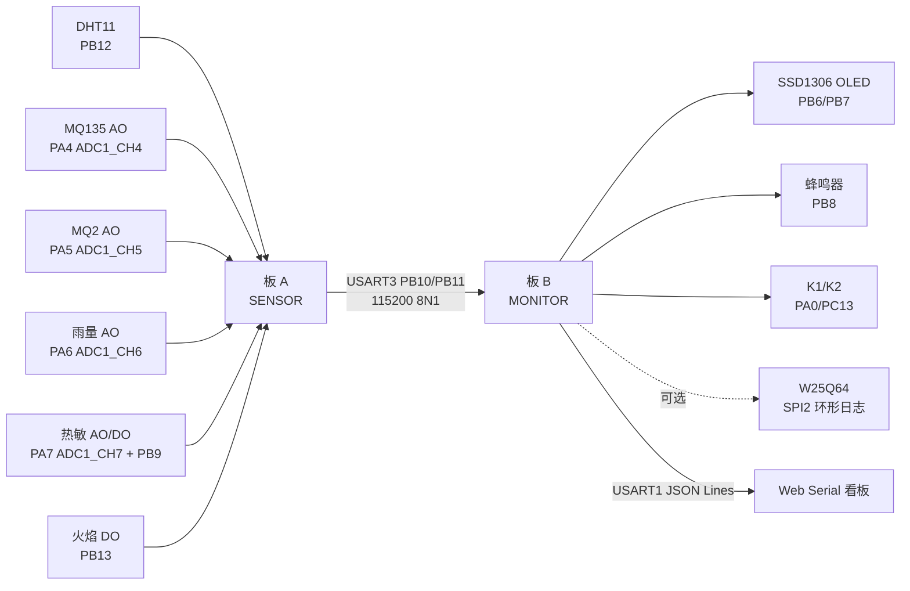

# dual-stm32-safety-monitor

> 双节点 STM32F103C8T6 环境安全监测系统：板 A 采集传感器，板 B 评估报警、显示状态、记录历史，并向浏览器看板输出 JSON Lines。

[English](README.md) | [简体中文](README.zh-CN.md)


## 项目简介

本仓库是双板 STM32F103C8T6 安全监测项目的 CLion + CMake 工作流。当前后端通过 `APP_NODE_ROLE` 编译出 SENSOR 和 MONITOR 两个固件镜像。

- **板 A：SENSOR 采集节点**  
  每秒采集 DHT11、MQ135、MQ2、雨量、热敏和火焰输入，平滑模拟量，并通过 USART3 发送协议 v2 二进制帧。

- **板 B：MONITOR 显示报警节点**  
  使用流式解码器恢复 USART3 数据帧，评估预警/危险/节点离线状态，刷新 SSD1306 OLED 页面，驱动蜂鸣器，处理 K1/K2，可选写入 W25Q64 固定记录，并通过 USART1 输出 JSON Lines。


```mermaid
flowchart LR
  DHT11[DHT11<br/>PB12] --> A[板 A<br/>SENSOR]
  MQ135[MQ135 AO<br/>PA4 ADC1_CH4] --> A
  MQ2[MQ2 AO<br/>PA5 ADC1_CH5] --> A
  Rain[雨量 AO<br/>PA6 ADC1_CH6] --> A
  Therm[热敏 AO/DO<br/>PA7 ADC1_CH7 + PB9] --> A
  Flame[火焰 DO<br/>PB13] --> A
  A -- USART3 PB10/PB11<br/>115200 8N1 --> B[板 B<br/>MONITOR]
  B --> OLED[SSD1306 OLED<br/>PB6/PB7]
  B --> Buzz[蜂鸣器<br/>PB8]
  B --> Keys[K1/K2<br/>PA0/PC13]
  B -. 可选 .-> Flash[W25Q64<br/>SPI2 环形日志]
  B -- USART1 JSON Lines --> Web[Web Serial 看板]
```

## 当前后端亮点

- `FrameCodec` 定义 22 字节协议 v2 数据帧；`FrameStreamDecoder` 能在噪声、重叠帧头和坏校验后重新同步。
- `AlarmEvaluator` 集中处理报警优先级：危险、等待、节点离线、预警、正常。
- `DisplayFormatter` 生成两页 OLED 内容：实时读数页和阈值/日志状态页。
- `W25q64FlashLogger` 是可选且非阻塞的记录器：sector 0 保存游标元数据，sector 1 到 8 MB 末尾保存 32 字节环形记录。
- MONITOR 输出 JSON schema v2，包含雨量、热敏、阈值档位、静音状态、Flash 是否可用和 Flash 记录数。
- 当前构建已经移除 WS2813/RGB 驱动文件。硬件参考页可以保留这些器件作为 legacy 或扩展说明，但它们不是现役固件输出。

## 参考引脚映射

| 角色 | 模块 | 引脚 |
|---|---|---|
| SENSOR | DHT11 DATA | `PB12` |
| SENSOR | MQ135 AO | `PA4 / ADC1_CH4` |
| SENSOR | MQ2 AO | `PA5 / ADC1_CH5` |
| SENSOR | 雨量 AO/SIG | `PA6 / ADC1_CH6` |
| SENSOR | 热敏 AO | `PA7 / ADC1_CH7` |
| SENSOR | 热敏 DO | `PB9`，低电平高温触发 |
| SENSOR | 火焰 DO | `PB13`，低电平有效 |
| MONITOR | OLED SCL/SDA | `PB6 / PB7`，软件 I2C |
| MONITOR | 蜂鸣器 | `PB8`，高电平响 |
| MONITOR | K1/K2 | `PA0 / PC13`，参考板上按下为高电平 |
| MONITOR 可选 | W25Q64 | `PB12 CS`，`PB13 SCK`，`PB14 MISO`，`PB15 MOSI` |
| 双板 | 板间通信 | USART3 `PB10/PB11`，TX/RX 交叉，共地 |
| 双板 | 调试/JSON 串口 | USART1 `PA9/PA10`，`115200 8N1` |

完整中英双语接线说明见 [WIRING.md](WIRING.md)。芯片和模块独立说明从 [docs/hardware/index.zh-CN.md](docs/hardware/index.zh-CN.md) 进入。

## 配套文档

- [WIRING.md](WIRING.md)：中英双语接线说明和板卡移植检查表。
- [docs/hardware/index.zh-CN.md](docs/hardware/index.zh-CN.md) / [English](docs/hardware/index.en.md)：每个芯片和模块的独立硬件资料。
- [docs/BOARD_AND_CHIP_REFERENCE.zh-CN.md](docs/BOARD_AND_CHIP_REFERENCE.zh-CN.md) / [English](docs/BOARD_AND_CHIP_REFERENCE.en.md)：硬件索引和板级总览。
- [docs/MODULE_REFERENCE.zh-CN.md](docs/MODULE_REFERENCE.zh-CN.md) / [English](docs/MODULE_REFERENCE.en.md)：模块索引和信号总览。
- [docs/CLION_CMAKE_GUIDE.zh-CN.md](docs/CLION_CMAKE_GUIDE.zh-CN.md) / [English](docs/CLION_CMAKE_GUIDE.en.md)：CLion + CMake Presets 工作流。
- [docs/FRONTEND_SERIAL_DASHBOARD.zh-CN.md](docs/FRONTEND_SERIAL_DASHBOARD.zh-CN.md) / [English](docs/FRONTEND_SERIAL_DASHBOARD.en.md)：Web Serial 看板说明。
- [docs/FUNCTION_GUIDE.zh-CN.md](docs/FUNCTION_GUIDE.zh-CN.md) / [English](docs/FUNCTION_GUIDE.en.md)：函数级阅读指南。
- [docs/FUNCTION_DESIGN_WALKTHROUGH.zh-CN.md](docs/FUNCTION_DESIGN_WALKTHROUGH.zh-CN.md) / [English](docs/FUNCTION_DESIGN_WALKTHROUGH.en.md)：固件设计 walkthrough。
- [docs/PROJECT_STRUCTURE.zh-CN.md](docs/PROJECT_STRUCTURE.zh-CN.md) / [English](docs/PROJECT_STRUCTURE.en.md)：仓库结构和修改入口。

## 构建

主流程是 CLion + CMake Presets + Ninja + ARM GCC。

```powershell
cmake --preset SensorDebug
cmake --build --preset SensorDebug

cmake --preset MonitorDebug
cmake --build --preset MonitorDebug
```

| Preset | 输出文件 | 烧录到 |
|---|---|---|
| `SensorDebug` | `build/SensorDebug/Env-Monitor_sensor.hex` | 板 A |
| `MonitorDebug` | `build/MonitorDebug/Env-Monitor_monitor.hex` | 板 B |

优化镜像可使用 `SensorRelease` 和 `MonitorRelease`。

## Web Serial 看板

板 B 通过 USART1 输出机器可读 JSON Lines。在仓库根目录启动 Vite 前端：

```powershell
npm --prefix frontend install
npm --prefix frontend run dev
```

用 Chrome 或 Edge 打开 `http://localhost:5173`，选择板 B 的 USB 转串口，参数为 `115200 8N1`；没有硬件时可使用模拟回放。看板支持中文/英文切换，覆盖 UI、parser 错误、AI/本地规则分析和事件日志标签。

## 通信协议

板 A 每秒发送一帧 22 字节 v2 数据。

```text
AA 55 LEN VER TEMP HUMI MQ135 MQ2 RAIN THERM_ADC THERM_C10 FLAME RAIN_WET THERM_HOT SEQ STATUS CHECKSUM
```

| 字段 | 含义 |
|---|---|
| `LEN` | 负载长度，v2 固定为 `18` |
| `VER` | 协议版本，固定为 `2` |
| `THERM_C10` | 热敏温度，单位 0.1 摄氏度 |
| `STATUS` | `bit0=DHT错误`，`bit1=热敏DO高温`，`bit2=雨量湿态`，`bit3=热敏ADC异常` |
| `CHECKSUM` | `LEN + payload bytes` 的低 8 位 |

MONITOR 会把合法二进制帧转换成 JSON schema v2。当前必需的 v2 扩展字段是 `rainRaw`、`thermRaw`、`thermC10`、`rainWet`、`thermHot` 和 `flashRecords`。固件可能继续输出 `externalRgb` 作为 legacy placeholder；看板不能把它当作必需的现役输出。

## 演示检查

1. 将 SENSOR 镜像烧录到板 A，将 MONITOR 镜像烧录到板 B。
2. USART3 TX/RX 交叉连接，并连接公共 GND。
3. 打开板 B 调试串口，参数 `115200 8N1`；如果板 A 也有调试口，也一起打开。
4. 确认板 B 打印 `[MONITOR] rx v2` 和 JSON Lines。
5. 验证 `normal`、`warn`、`danger` 以及前端 stale/node-lost 在 OLED、蜂鸣器、看板状态和 W25Q64 记录数上的表现。

## 注意事项

- MQ 数值是 ADC 原始值，若要解释为 ppm 需要现场标定。
- 所有 ADC 输入必须位于 0 到 VDDA 范围内。
- W25Q64 是可选器件；不接时监测、OLED、蜂鸣器和 JSON 输出仍可工作。
