# Function Design And Coordination Walkthrough

[Chinese version](FUNCTION_DESIGN_WALKTHROUGH.zh-CN.md) | [English README](../README.md) | [Chinese README](../README.zh-CN.md) | [Function Guide](FUNCTION_GUIDE.md) | [Project Structure](PROJECT_STRUCTURE.md)

This document explains how the functional parts of the dual-STM32 monitor are designed and coordinated. It is not just a function list: it connects startup, role selection, sensor sampling, frame encoding, USART3 reception, alarm decisions, OLED rendering, optional flash logging, and error recovery into one system-level story.

## 1. System Design

The project uses two STM32F103C8T6 boards as a small distributed embedded system.

| Node | Role | Main responsibility | Key functions |
|---|---|---|---|
| Board A | SENSOR | Read DHT11, MQ135, MQ2, and flame sensor; build a frame; send it through USART3 | `Sensor_App_Run()`, `DHT11_Read()`, `ADC1_ReadChannel()`, `Frame_Encode()`, `Sensor_SendFrame()` |
| Board B | MONITOR | Receive and verify frames; update OLED; drive RGB/buzzer alarm; handle buttons; optionally log to flash | `Monitor_App_Run()`, `Monitor_ProcessRx()`, `Frame_Decode()`, `Monitor_UpdateAlarm()`, `Monitor_UpdateDisplay()`, `Flash_LogFrame()` |

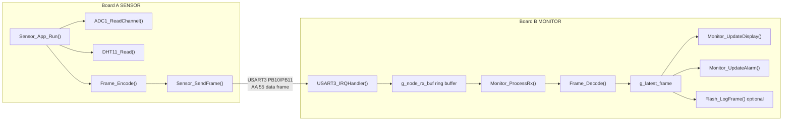

The core design choice is one shared source file with two build roles. Protocol structures, serial helpers, data encoding, and display/alarm logic stay in one place, while CMake selects whether the image behaves as Board A or Board B.

## 2. Build-Time Role Selection

The firmware role is selected by `APP_NODE_ROLE`.

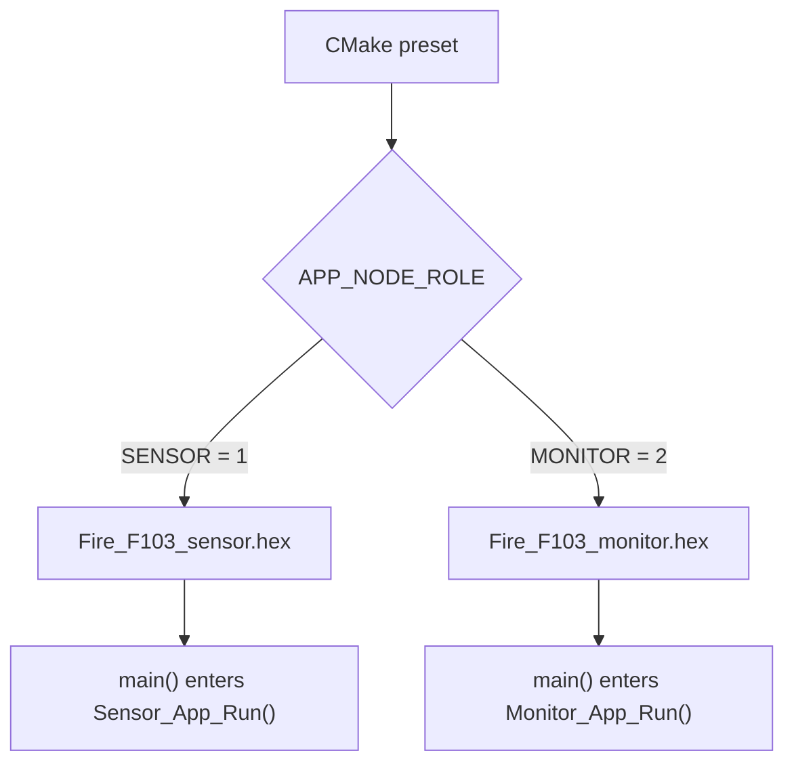

| Design point | Location | Purpose |
|---|---|---|
| Role macros | `APP_ROLE_SENSOR`, `APP_ROLE_MONITOR` | Keep role checks readable in preprocessor blocks |
| CMake mapping | `CMakeLists.txt` | Convert `SENSOR` and `MONITOR` presets into `APP_NODE_ROLE=1/2` |
| Unused-function handling | `APP_MAYBE_UNUSED` | Suppress warnings when a role-specific helper is not called in the other firmware |
| Output names | `Fire_F103_sensor`, `Fire_F103_monitor` | Keep the two firmware products separate |

## 3. Startup Path

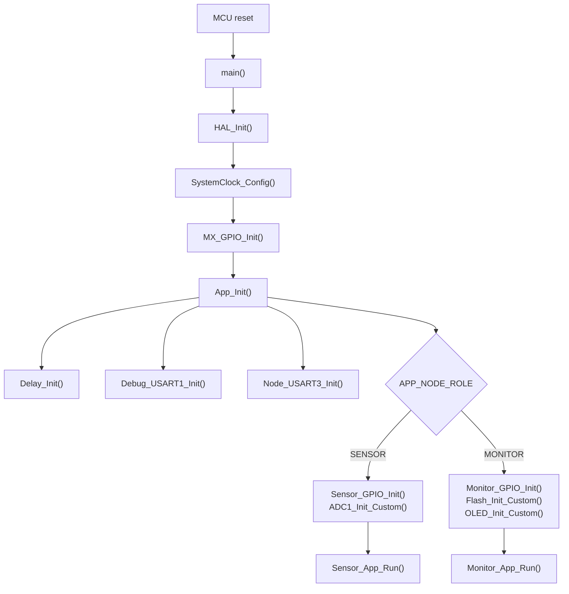

| Function | Design intent | Coordination |
|---|---|---|
| `main()` | Common entry point for both firmware images | Initializes HAL, clock, GPIO, application peripherals, then enters one role loop |
| `SystemClock_Config()` | Set the board to 72 MHz SYSCLK | Provides stable timing for USART, SPI, ADC, DWT delay, and HAL tick |
| `MX_GPIO_Init()` | Initialize shared board resources | Configures K1/K2 and the active-low RGB LED pins |
| `App_Init()` | Separate common initialization from role-specific initialization | Always initializes USART1/USART3, then initializes only the current node's peripherals |
| `Delay_Init()` | Enable DWT cycle counter | Enables `Delay_Us()` for DHT11 timing and software I2C |
| `Debug_USART1_Init()` | Keep USART1 as the CH340C debug channel | Supports `printf()` through `__io_putchar()` |
| `Node_USART3_Init()` | Configure the board-to-board link | Board B also enables `USART3_IRQHandler()` |
| `Error_Handler()` | Stop safely on unrecoverable initialization errors | Used when HAL clock configuration fails |
| `assert_failed()` | Hook for full assert builds | Can later be extended to print file and line through USART1 |

## 4. Board A Sampling Pipeline

Board A sends one data frame every second inside `Sensor_App_Run()`. MQ135, MQ2, and flame state are refreshed in every frame; DHT11 is refreshed at the safe greater-than-2-second interval required by the module manual, and skipped frames reuse the last temperature/humidity reading.

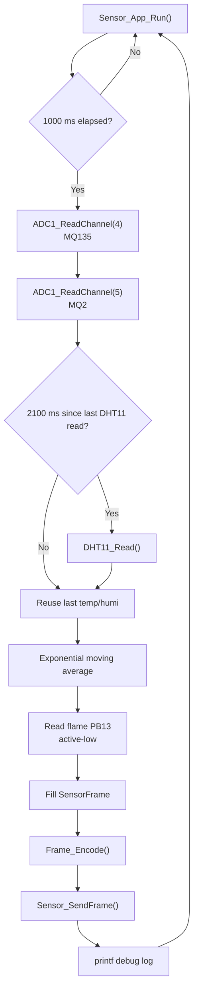

| Function | Role in the chain | Design details |
|---|---|---|
| `Sensor_GPIO_Init()` | Pin preparation | PA4/PA5 analog inputs for MQ modules, PB13 input for flame, PB12 open-drain for DHT11 |
| `ADC1_Init_Custom()` | ADC preparation | Enables ADC1, selects safe ADC clock, calibrates before sampling |
| `ADC1_ReadChannel()` | MQ analog sampling | Performs one conversion and returns a raw 12-bit reading |
| `DHT11_Read()` | Temperature/humidity sampling | Runs the full DHT11 timing protocol and checksum verification at the DHT11-safe refresh interval |
| `Sensor_SendFrame()` | Transport handoff | Encodes one `SensorFrame` and sends it on USART3 |

MQ values use a simple integer exponential moving average:

```text
first sample: avg = raw
next samples: avg = (avg * 3 + raw) / 4
```

This avoids storing a full sample window, reduces noise, and stays friendly to a small MCU.

## 5. DHT11 Timing Design

The DHT11 interface is split into small helpers because it is timing-sensitive.

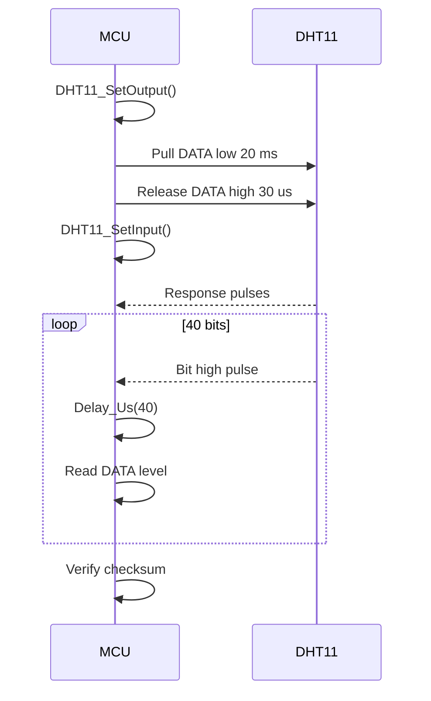

| Function | Why it exists |
|---|---|
| `DHT11_SetOutput()` | Lets the MCU pull the bus low for the start signal |
| `DHT11_SetInput()` | Releases the bus so the sensor can drive data |
| `DHT11_WaitLevel()` | Waits for expected high/low transitions with timeout protection |
| `DHT11_Read()` | Orchestrates the whole protocol and returns success/failure |

DHT11 reads are separated by `DHT11_PERIOD_MS = 2100`; with the 1-second frame period this refreshes about every 3 seconds. If DHT11 fails, the system keeps running and sets `STATUS_DHT_ERROR` in the frame instead of blocking the whole node.

## 6. Frame Protocol

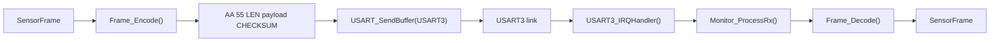

| Function | Design role |
|---|---|
| `Frame_Checksum()` | Adds `LEN + payload` and returns the low 8 bits |
| `Frame_Encode()` | Converts `SensorFrame` to the fixed 13-byte wire format |
| `Frame_Decode()` | Verifies header, length, checksum, then rebuilds `SensorFrame` |
| `Monitor_ProcessRx()` | Re-synchronizes on `AA 55` and rejects bad frames |

Frame bytes:

| Index | Field | Meaning |
|---|---|---|
| 0-1 | `AA 55` | Header |
| 2 | `LEN` | Fixed payload length `9` |
| 3-4 | `TEMP/HUMI` | DHT11 values |
| 5-8 | `MQ135/MQ2` | ADC readings, high byte first |
| 9 | `FLAME` | `1` when flame is detected |
| 10 | `SEQ` | Rolling sequence number |
| 11 | `STATUS` | bit0 = DHT11 error |
| 12 | `CHECKSUM` | Low 8 bits of `LEN + payload` |

## 7. Board B Receive Design

The USART interrupt stores bytes only; parsing happens in the main loop.

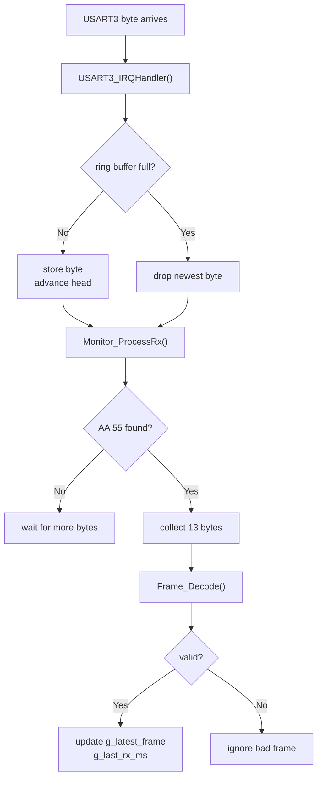

This keeps the ISR short and predictable. A bad or partial frame can only be dropped; it cannot corrupt the latest valid display data.

## 8. Board B Cooperative Scheduler

`Monitor_App_Run()` is a cooperative super-loop.

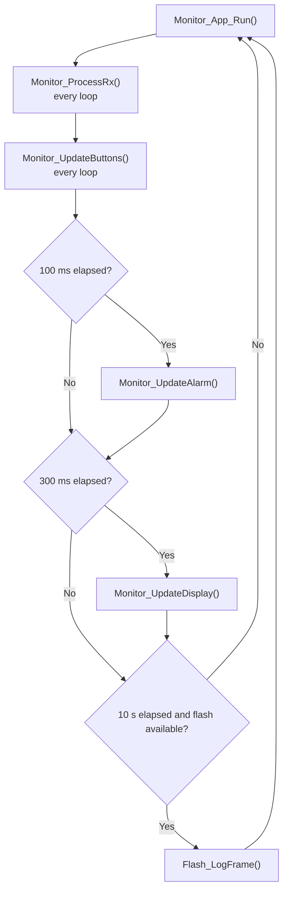

| Task | Frequency | Function | Reason |
|---|---|---|---|
| RX parsing | Every loop | `Monitor_ProcessRx()` | Keep serial data from piling up |
| Buttons | Every loop | `Monitor_UpdateButtons()` | Make K1/K2 responsive |
| Alarm | 100 ms | `Monitor_UpdateAlarm()` | Keep buzzer/LED patterns smooth |
| OLED | 300 ms | `Monitor_UpdateDisplay()` | Avoid wasting time refreshing too often |
| Flash log | 10 s | `Flash_LogFrame()` | Reduce flash write frequency |

## 9. Button Interaction

`Monitor_UpdateButtons()` uses edge detection instead of blocking waits.

| Button | Action | State variable |
|---|---|---|
| K1 press | Switch OLED page | `g_page` |
| K2 short press | Mute buzzer for 60 s | `g_mute_until_ms` |
| K2 long press | Cycle threshold profile | `g_threshold_profile` |

The mute state only affects the buzzer. LED color still reflects the true system status.

## 10. Alarm Priority

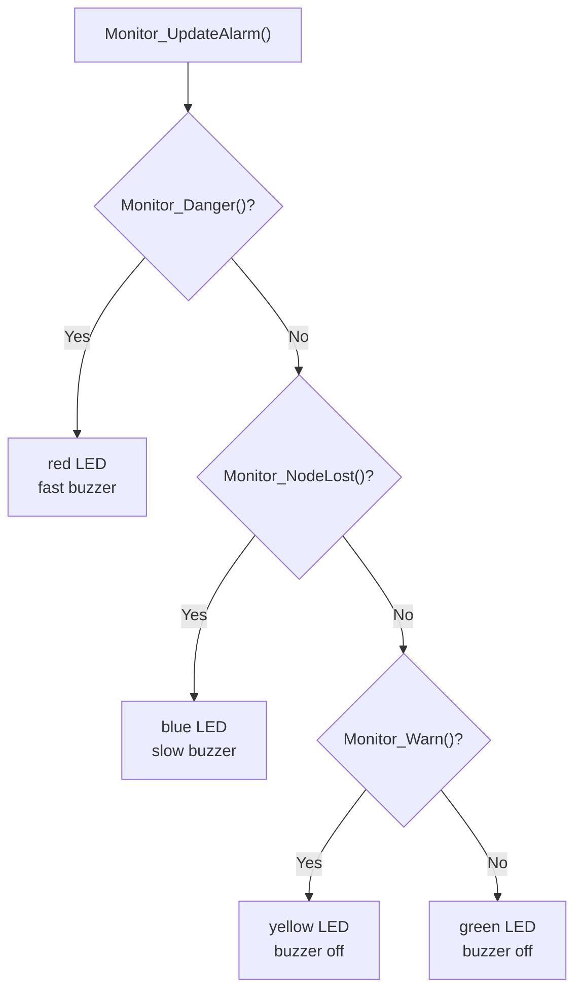

| Function | Meaning |
|---|---|
| `Monitor_NodeLost()` | No valid sensor frame for more than 3 seconds |
| `Monitor_Danger()` | Flame detected or MQ2 reaches danger threshold |
| `Monitor_Warn()` | DHT11 error, MQ135 warning, MQ2 warning, or node-lost state |
| `Monitor_UpdateAlarm()` | Applies priority and drives `LED_Set()` / `Buzzer_Set()` |

Priority order is danger, node-lost, warning, normal. This prevents stale or missing data from being shown as normal.

## 11. OLED Display Stack

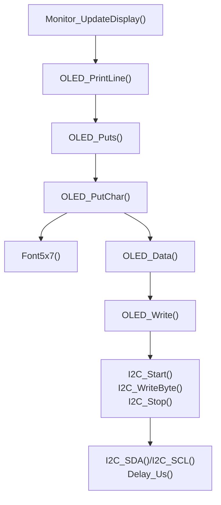

| Layer | Functions | Responsibility |
|---|---|---|
| Page layer | `Monitor_UpdateDisplay()` | Decide which four text lines to show |
| Text layer | `OLED_PrintLine()`, `OLED_Puts()`, `OLED_PutChar()`, `Font5x7()` | Convert strings into pixel columns |
| OLED command layer | `OLED_Init_Custom()`, `OLED_Clear()`, `OLED_SetCursor()`, `OLED_Cmd()`, `OLED_Data()` | Talk to the SSD1306 controller |
| Software-I2C layer | `I2C_Start()`, `I2C_Stop()`, `I2C_WriteByte()`, `I2C_SDA()`, `I2C_SCL()`, `I2C_Delay()` | Generate the GPIO-based I2C waveform |

## 12. Optional W25Q64 Logging

Flash logging is optional: if the JEDEC ID is not valid, monitoring continues without logging.

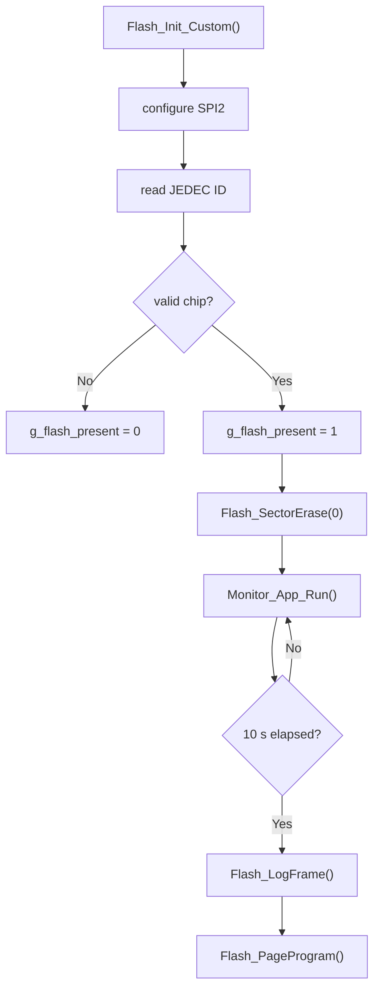

| Function | Purpose |
|---|---|
| `Flash_CS()` | Control chip select |
| `SPI2_TxRx()` | Transfer one SPI byte |
| `Flash_ReadStatus()` / `Flash_WaitReady()` | Wait until erase/program operations finish |
| `Flash_WriteEnable()` | Enable write/erase operations |
| `Flash_SectorErase()` | Erase one 4 KB sector |
| `Flash_PageProgram()` | Write one short record |
| `Flash_Init_Custom()` | Detect whether a compatible flash chip is present |
| `Flash_LogFrame()` | Save sensor values, alarm state, tick time, profile, and checksum |

## 13. Debug Logging

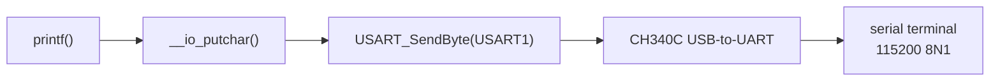

USART1 is reserved for debug logs because `PA9/PA10` are already routed to the on-board CH340C bridge.

## 14. Shared State Variables

| Variable | Written by | Read by | Purpose |
|---|---|---|---|
| `g_latest_frame` | `Monitor_ProcessRx()` | display, alarm, flash logic | Latest valid sensor data |
| `g_last_rx_ms` | `Monitor_ProcessRx()` | `Monitor_NodeLost()` | Node-lost timing |
| `g_page` | `Monitor_UpdateButtons()` | `Monitor_UpdateDisplay()` | OLED page selection |
| `g_threshold_profile` | `Monitor_UpdateButtons()` | warning/danger/display/logging | Current threshold profile |
| `g_mute_until_ms` | `Monitor_UpdateButtons()` | `Monitor_UpdateAlarm()` | Buzzer mute deadline |
| `g_flash_present` | `Flash_Init_Custom()` | display/logging | Whether optional flash exists |
| `g_flash_log_addr` | `Flash_LogFrame()` | `Flash_LogFrame()` | Next log address |
| `g_node_rx_buf/head/tail` | ISR and `USART_ReadByte()` | `Monitor_ProcessRx()` | USART3 receive handoff |

## 15. End-To-End Data Path

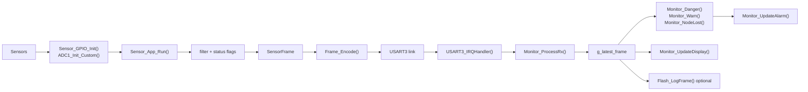

The flow is intentionally modular: sampling, framing, reception, alarm decisions, display output, and optional logging are separate stages connected by a small set of state variables.

## 16. Fault Handling

| Fault | Detection point | Response |
|---|---|---|
| DHT11 read failure | `DHT11_Read()` returns `0` | Board A still sends a frame with `STATUS_DHT_ERROR` |
| Serial noise or byte slip | `Frame_Decode()` fails | Bad frame is ignored; parser resynchronizes on `AA 55` |
| RX buffer full | `USART3_IRQHandler()` | Drop newest byte instead of blocking inside ISR |
| Board A disconnected | `Monitor_NodeLost()` | OLED shows `NODE LOST`; blue LED and slow buzzer |
| Flash not connected | `Flash_Init_Custom()` | `g_flash_present=0`; core monitoring still works |
| Flash sector full | `Flash_LogFrame()` | Erase sector 0 and wrap address back to zero |
| Clock configuration failure | `SystemClock_Config()` | `Error_Handler()` disables interrupts and stops |
| Full assert failure | `assert_failed()` | Hook kept for future debug output |

## 17. Project Walkthrough Notes

A concise project walkthrough can follow this order:

1. Show the dual-node architecture: Board A samples, Board B displays and alarms, USART3 links them.
2. Explain why USART1 is reserved for CH340C debug logs.
3. Walk through Board A: DHT11 timing, MQ ADC sampling, flame input, smoothing, frame encoding.
4. Walk through Board B: interrupt ring buffer, frame resynchronization, checksum, OLED/alarm/button logic.
5. Explain robustness: DHT11 error flag, bad-frame rejection, node-lost detection, optional flash logging.

The project can be summarized as a small dual-MCU safety-monitoring system with clear node roles, a defined serial protocol, cooperative scheduling, and explicit recovery behavior.
