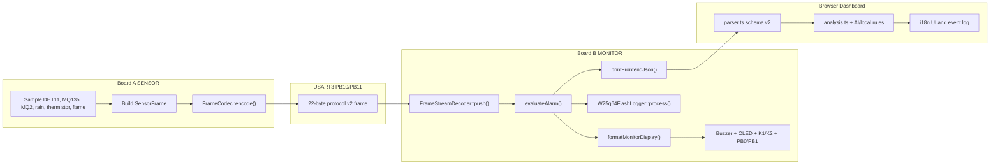
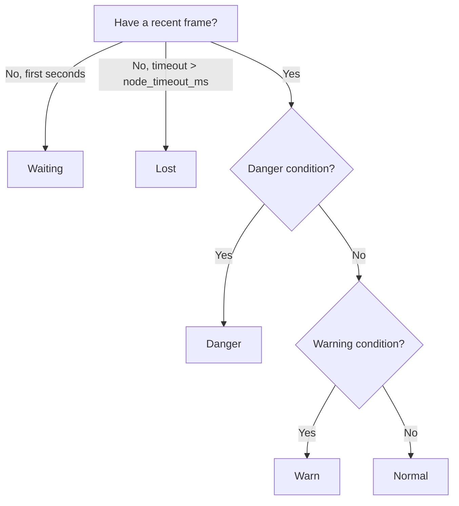

# Function Design Walkthrough

[README](../README.md) | [Chinese](FUNCTION_DESIGN_WALKTHROUGH.zh-CN.md) | [Function guide](FUNCTION_GUIDE.en.md) | [Project structure](PROJECT_STRUCTURE.en.md)

This walkthrough explains how the current backend works as a complete dual-board system. It reflects the active CMake build: SENSOR acquisition, MONITOR stream decoding, OLED, buzzer, onboard and external buttons, optional W25Q64 logging, and Web Serial JSON output.

## System Flow


```mermaid
flowchart LR
  subgraph A["Board A SENSOR"]
    S1["Sample DHT11, MQ135, MQ2, rain, thermistor, flame"]
    S2["Build SensorFrame"]
    S3["FrameCodec::encode()"]
  end

  subgraph Link["USART3 PB10/PB11"]
    L1["22-byte protocol v2 frame"]
  end

  subgraph B["Board B MONITOR"]
    M1["FrameStreamDecoder::push()"]
    M2["evaluateAlarm()"]
    M3["formatMonitorDisplay()"]
    M4["Buzzer + OLED + K1/K2 + PB0/PB1"]
    M5["W25q64FlashLogger::process()"]
    M6["printFrontendJson()"]
  end

  subgraph Web["Browser Dashboard"]
    W1["parser.ts schema v2"]
    W2["analysis.ts + AI/local rules"]
    W3["i18n UI and event log"]
  end

  S1 --> S2 --> S3 --> L1 --> M1 --> M2
  M2 --> M3 --> M4
  M2 --> M5
  M2 --> M6 --> W1 --> W2 --> W3
```

## Role Selection

`CMakePresets.json` selects `APP_NODE_ROLE`; `Core/Src/main.cpp` uses that compile-time role to instantiate exactly one node object.

| Preset | Compile definition | Main object | Output |
|---|---|---|---|
| `SensorDebug` / `SensorRelease` | `APP_NODE_ROLE=1` | `SensorNode` | `Env-Monitor_sensor.*` |
| `MonitorDebug` / `MonitorRelease` | `APP_NODE_ROLE=2` | `MonitorNode` | `Env-Monitor_monitor.*` |

Common initialization always runs first: HAL, 72 MHz system clock, board-level GPIO, DWT delay, USART1 debug/JSON, and USART3 board link. The monitor role enables USART3 RX interrupt so bytes can be pushed into the ring buffer while the cooperative loop continues.

## SENSOR Backend

`SensorNode::run()` sends one frame every `sensor_period_ms`.

| Input | Source | Frame field |
|---|---|---|
| DHT11 temperature/humidity | `Dht11::read()` every `dht11_period_ms` | `temp`, `humi`, `DhtError` status bit |
| MQ135 | ADC1 channel 4 on `PA4` | `mq135_adc` |
| MQ2 | ADC1 channel 5 on `PA5` | `mq2_adc` |
| Rain sensor | ADC1 channel 6 on `PA6` | `rain_adc`, `rain_wet`, `RainWet` status bit |
| Thermistor AO | ADC1 channel 7 on `PA7` | `therm_adc`, `therm_c10`, `ThermAdcError` status bit |
| Thermistor DO | GPIO `PB9`, active-low | `therm_hot`, `ThermHotDigital` status bit |
| Flame DO | GPIO `PB13`, active-low | `flame` |

Analog MQ/rain/thermistor values use a small smoothing filter after the first sample. The thermistor conversion is intentionally table-based so the firmware does not need runtime floating point. Invalid extreme ADC values mark the thermistor ADC fault bit and set the reported thermistor temperature to zero.

## Protocol v2

The wire format is fixed-size and simple enough to inspect with a serial analyzer.

```text
AA 55 LEN VER TEMP HUMI MQ135 MQ2 RAIN THERM_ADC THERM_C10 FLAME RAIN_WET THERM_HOT SEQ STATUS CHECKSUM
```

| Property | Current value |
|---|---|
| Header | `0xAA 0x55` |
| Version | `2` |
| Payload length | `18` |
| Total length | `22` |
| Multi-byte order | Big-endian for 16-bit fields |
| Checksum | Low 8 bits of `LEN + payload bytes` |

`FrameStreamDecoder` exists because the monitor receives a byte stream, not pre-cut packets. It keeps a small buffer, waits for `AA 55`, handles overlapping headers, rejects bad frames, then returns to searching without blocking the monitor loop.

## MONITOR Scheduler

`MonitorNode::run()` is a cooperative loop. Each iteration does a small amount of work and returns quickly.

| Task | Cadence | Function |
|---|---|---|
| Consume RX bytes | Every loop | `processRx()` |
| Scan buttons | Every loop | `updateButtons()` |
| Advance flash state machine | Every loop | `flash_.process()` |
| Recompute alarm and buzzer | Every `alarm_period_ms` | `evaluateAlarm()`, `updateAlarm()` |
| Refresh OLED | Every `ui_period_ms` | `formatMonitorDisplay()`, `updateDisplay()` |
| Schedule flash log | State change or every `flash_log_period_ms` | `flash_.logFrame()` |

This design avoids long waits in the main loop. Flash erase/program completion is polled by `W25q64FlashLogger::process()`, so display and serial receive remain responsive while flash operations are in flight.

## Alarm Evaluation

`evaluateAlarm()` turns the latest frame and monitor timing into a compact `AlarmEvaluation`.


```mermaid
flowchart TD
  A["Have a recent frame?"] -->|No, first seconds| W["Waiting"]
  A -->|No, timeout > node_timeout_ms| L["Lost"]
  A -->|Yes| D{"Danger condition?"}
  D -->|Yes| Danger["Danger"]
  D -->|No| R{"Warning condition?"}
  R -->|Yes| Warn["Warn"]
  R -->|No| Normal["Normal"]
```

Danger conditions are flame trigger, MQ2 danger threshold, thermistor DO high-temperature trigger, or thermistor temperature above the active danger threshold. Warning conditions are DHT11 error, MQ135 warning threshold, MQ2 warning threshold, rain wet state, rain ADC above the wet threshold, thermistor ADC fault, or thermistor temperature above the warning threshold.

K2 short press sets `mute_until_ms = now + mute_time_ms`. Muting affects buzzer output only; alarm state, OLED, JSON, and flash logging still reflect the real risk state.

## Threshold Model

Board B keeps four independent threshold levels in `ThresholdLevels`: MQ135 air, MQ2 smoke, rain, and thermistor. Each level is stored as `0..4`, while OLED and human-facing docs show `1/5..5/5`. Level 2 is the power-on default and preserves the previous default behavior.

| Sensor | Level 2 default | JSON level field | JSON value fields |
|---|---|---|---|
| MQ135 | `air_warn=2200` | `thresholdAirLevel` | `thresholdAirWarn` |
| MQ2 | `smoke_warn=1800`, `smoke_danger=2800` | `thresholdSmokeLevel` | `thresholdSmokeWarn`, `thresholdSmokeDanger` |
| Rain | `rain_wet=1400` | `thresholdRainLevel` | `thresholdRainWet` |
| Thermistor | `therm_warn=45.0C`, `therm_danger=70.0C` | `thresholdThermLevel` | `thresholdThermWarnC10`, `thresholdThermDangerC10` |

`thresholdsFromLevels()` converts these four levels into the active `AlarmThresholds`. The legacy `thresholdProfile` JSON field is still emitted for compatibility: `0` means all defaults, `1` all old sensitive levels, `2` all old loose levels, and `255` means mixed/custom.

## OLED And Buttons

`DisplayFormatter` keeps OLED text construction out of the monitor loop.

| Page | Lines |
|---|---|
| Page 0 | State title, DHT11 temperature/humidity, MQ135/MQ2, rain/thermistor |
| Page 1 | Selected threshold sensor, level `1/5..5/5`, active threshold values, A/M/R/T level summary, sequence, flash presence, flash record count |

K1 toggles page 0/page 1. K2 short press mutes the buzzer for 60 seconds. PB0 is an external active-low key with internal pull-up that cycles the selected threshold sensor: MQ135, MQ2, rain, thermistor. PB1 is another active-low key that cycles the selected sensor through five levels. Pressing either external threshold key automatically shows page 1.

## Optional W25Q64 Logging

The logger is optional. `W25q64FlashLogger::init()` calls `MX_SPI2_Init()`, uses HAL SPI on `PB13/PB14/PB15` with `PB12` as GPIO CS, and reads JEDEC ID. If the ID does not match a supported W25Q64-compatible part, `present()` returns false and the monitor continues without logging.

| Area | Format |
|---|---|
| Sector 0 | 16-byte cursor metadata entries with magic, version, log address, record count, CRC |
| Sector 1 to end | 32-byte circular records with frame values, alarm state, tick, packed four threshold levels plus mute bit, record count, CRC |

Records are scheduled when the alarm state changes or when the periodic logging interval expires. The logger erases a sector only when the next circular write reaches that sector boundary.

## JSON Lines And Frontend Schema

After each accepted frame, `MonitorNode::printFrontendJson()` emits one JSON object on USART1. Current firmware emits schema v2.

```json
{
  "type": "sensor",
  "schemaVersion": 2,
  "seq": 31,
  "tickMs": 123456,
  "tempC": 26,
  "humidityPct": 54,
  "mq135Raw": 1020,
  "mq2Raw": 860,
  "rainRaw": 980,
  "thermRaw": 1660,
  "thermC10": 325,
  "rainWet": 0,
  "thermHot": 0,
  "flame": 0,
  "status": 0,
  "alarm": "normal",
  "thresholdProfile": 0,
  "selectedThresholdSensor": 0,
  "thresholdAirLevel": 2,
  "thresholdSmokeLevel": 2,
  "thresholdRainLevel": 2,
  "thresholdThermLevel": 2,
  "thresholdAirWarn": 2200,
  "thresholdSmokeWarn": 1800,
  "thresholdSmokeDanger": 2800,
  "thresholdRainWet": 1400,
  "thresholdThermWarnC10": 450,
  "thresholdThermDangerC10": 700,
  "mute": 0,
  "flashReady": 1,
  "flashRecords": 42,
  "externalRgb": 0
}
```

The frontend parser accepts legacy schema v1 records by filling rain/thermistor/flash-count extension fields with `null` or `0`. Schema v2 records must include the v2 extension fields. New threshold fields are optional for backward compatibility; when present, local analysis uses the actual values, and when absent it falls back to `thresholdProfile`. `selectedThresholdSensor` maps `0=MQ135`, `1=MQ2`, `2=RAIN`, `3=THERM`. `externalRgb` is a legacy placeholder that may appear in current JSON output, but it is not a required dashboard field and does not mean the current CMake build drives WS2813/RGB hardware. The dashboard marks data stale after `STALE_AFTER_MS` without a fresh frame and displays node-lost style risk even if the last JSON line said `normal`.

## Failure Modes

| Situation | Handling |
|---|---|
| USART3 noise or misalignment | `FrameStreamDecoder` drops bad bytes and searches for the next valid header. |
| Bad checksum | Decoder reports `BadFrame`; monitor logs a bad-frame line and recovers. |
| Board A silent | Alarm evaluation transitions from waiting to lost after timeout. |
| DHT11 read error | SENSOR sets status bit 0; monitor treats it as warning. |
| Thermistor ADC invalid | SENSOR sets status bit 3; monitor treats it as warning and avoids using invalid temperature for danger. |
| W25Q64 absent or timeout | Logger disables itself; monitor keeps running. |
| Browser has no Web Serial | Dashboard exposes replay mode and localized support text. |

## i18n Boundary

Runtime i18n is implemented in the browser dashboard and documentation. Firmware OLED and debug strings remain compact English/protocol labels to preserve flash/RAM simplicity and keep serial output stable for parsers.
