# Function Design And Coordination Walkthrough

[Chinese version](FUNCTION_DESIGN_WALKTHROUGH.zh-CN.md) | [English README](../README.md) | [Chinese README](../README.zh-CN.md) | [Function Guide](FUNCTION_GUIDE.md) | [Project Structure](PROJECT_STRUCTURE.md)

This document explains how the functional parts of the dual-STM32 monitor are designed and coordinated. It is not just a function list: it connects startup, role selection, sensor sampling, frame encoding, USART3 reception, alarm decisions, OLED rendering, optional flash logging, and error recovery into one system-level story.

## 1. System Design

The project uses two STM32F103C8T6 boards as a small distributed embedded system.

| Node | Role | Main responsibility | Key functions |
|---|---|---|---|
| Board A | SENSOR | Read DHT11, MQ135, MQ2, rain, thermistor, and flame inputs; build a v2 frame; send it through USART3 | `SensorNode::run()`, `Dht11::read()`, `hal::readAdc1Channel()`, `FrameCodec::encode()`, `SensorNode::sendFrame()` |
| Board B | MONITOR | Receive and verify frames; update OLED; drive RGB/buzzer/external RGB alarm; handle buttons; optionally log to flash | `MonitorNode::run()`, `MonitorNode::processRx()`, `FrameCodec::decode()`, `MonitorNode::updateAlarm()`, `MonitorNode::updateDisplay()`, `W25q64FlashLogger::logFrame()` |

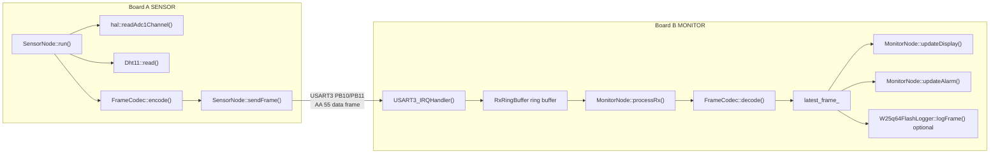
```mermaid
flowchart LR
  subgraph "Board A SENSOR"
    A1["SensorNode::run()"] --> A2["hal::readAdc1Channel()"]
    A1 --> A3["Dht11::read()"]
    A1 --> A4["FrameCodec::encode()"]
    A4 --> A5["SensorNode::sendFrame()"]
  end

  A5 -- "USART3 PB10/PB11\nAA 55 data frame" --> B1

  subgraph "Board B MONITOR"
    B1["USART3_IRQHandler()"] --> B2["RxRingBuffer ring buffer"]
    B2 --> B3["MonitorNode::processRx()"]
    B3 --> B4["FrameCodec::decode()"]
    B4 --> B5["latest_frame_"]
    B5 --> B6["MonitorNode::updateDisplay()"]
    B5 --> B7["MonitorNode::updateAlarm()"]
    B5 --> B8["W25q64FlashLogger::logFrame() optional"]
  end
```

The core design choice is one shared source file with two build roles. Protocol structures, serial helpers, data encoding, and display/alarm logic stay in one place, while CMake selects whether the image behaves as Board A or Board B.

## 2. Build-Time Role Selection

The firmware role is selected by `APP_NODE_ROLE`.

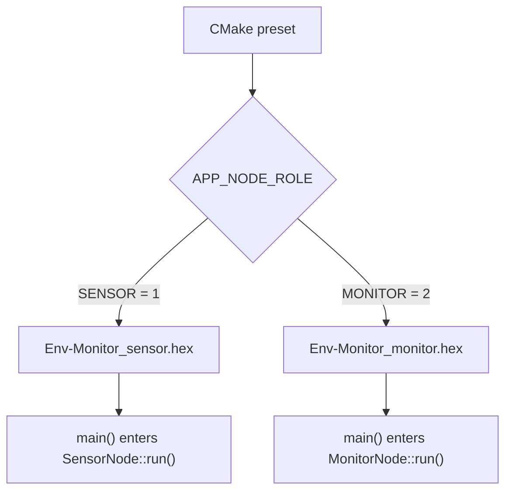
```mermaid
flowchart TD
  P["CMake preset"] --> S{"APP_NODE_ROLE"}
  S -->|"SENSOR = 1"| A["Env-Monitor_sensor.hex"]
  S -->|"MONITOR = 2"| B["Env-Monitor_monitor.hex"]
  A --> C["main() enters SensorNode::run()"]
  B --> D["main() enters MonitorNode::run()"]
```

| Design point | Location | Purpose |
|---|---|---|
| Role macros | `APP_ROLE_SENSOR`, `APP_ROLE_MONITOR` | Keep role checks readable in preprocessor blocks |
| CMake mapping | `CMakeLists.txt` | Convert `SENSOR` and `MONITOR` presets into `APP_NODE_ROLE=1/2` |
| Unused-function handling | `APP_MAYBE_UNUSED` | Suppress warnings when a role-specific helper is not called in the other firmware |
| Output names | `Env-Monitor_sensor`, `Env-Monitor_monitor` | Current artifact names used to keep the two firmware products separate |

## 3. Startup Path

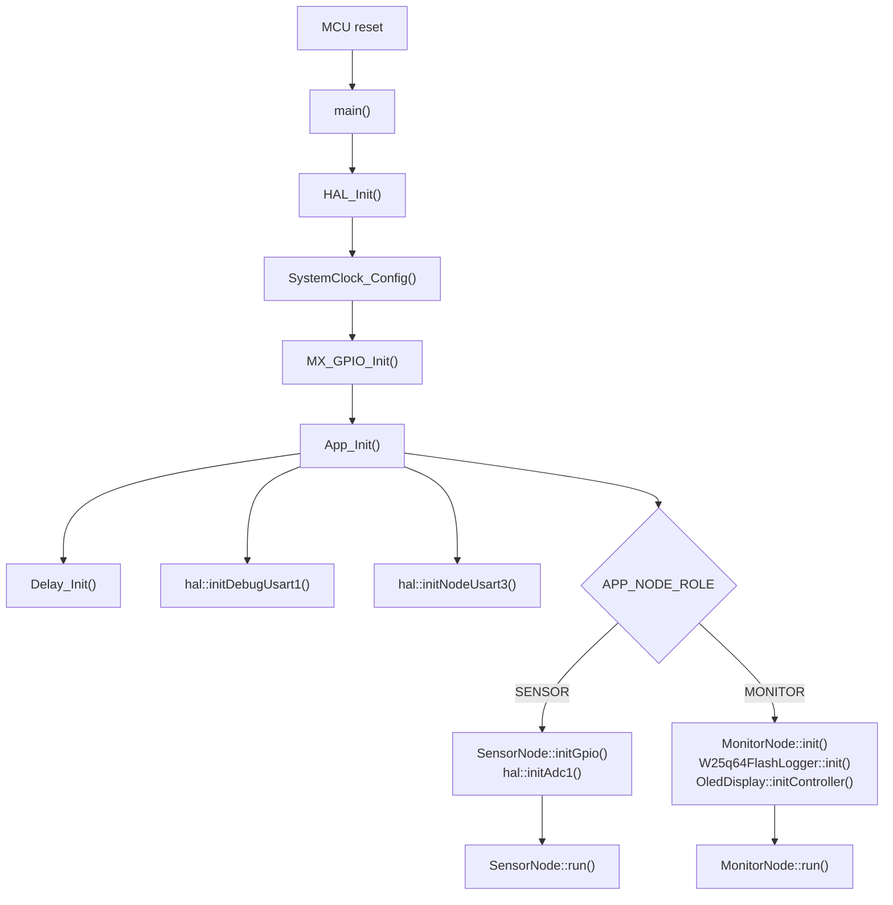
```mermaid
flowchart TD
  R["MCU reset"] --> M["main()"]
  M --> H["HAL_Init()"]
  H --> C["SystemClock_Config()"]
  C --> G["MX_GPIO_Init()"]
  G --> I["App_Init()"]
  I --> D["Delay_Init()"]
  I --> U1["hal::initDebugUsart1()"]
  I --> U3["hal::initNodeUsart3()"]
  I --> K{"APP_NODE_ROLE"}
  K -->|"SENSOR"| SA["SensorNode::initGpio()\nhal::initAdc1()"]
  K -->|"MONITOR"| MB["MonitorNode::init()\nW25q64FlashLogger::init()\nOledDisplay::initController()"]
  SA --> SL["SensorNode::run()"]
  MB --> ML["MonitorNode::run()"]
```

| Function | Design intent | Coordination |
|---|---|---|
| `main()` | Common entry point for both firmware images | Initializes HAL, clock, GPIO, application peripherals, then enters one role loop |
| `SystemClock_Config()` | Set the board to 72 MHz SYSCLK | Provides stable timing for USART, SPI, ADC, DWT delay, and HAL tick |
| `MX_GPIO_Init()` | Initialize shared board resources | Configures K1/K2 and the active-low RGB LED pins |
| `App_Init()` | Separate common initialization from role-specific initialization | Always initializes USART1/USART3, then initializes only the current node's peripherals |
| `Delay_Init()` | Enable DWT cycle counter | Enables `Delay_Us()` for DHT11 timing and software I2C |
| `hal::initDebugUsart1()` | Keep USART1 as the USB-UART debug channel | Supports `printf()` through `__io_putchar()` |
| `hal::initNodeUsart3()` | Configure the board-to-board link | Board B also enables `USART3_IRQHandler()` |
| `Error_Handler()` | Stop safely on unrecoverable initialization errors | Used when HAL clock configuration fails |
| `assert_failed()` | Hook for full assert builds | Can later be extended to print file and line through USART1 |

## 4. Board A Sampling Pipeline

Board A sends one data frame every second inside `SensorNode::run()`. MQ135, MQ2, rain, thermistor, and flame state are refreshed in every frame; DHT11 is refreshed at a safe greater-than-2-second interval, and skipped frames reuse the last temperature/humidity reading.

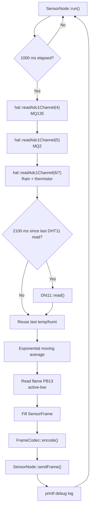
```mermaid
flowchart TD
  L["SensorNode::run()"] --> T{"1000 ms elapsed?"}
  T -->|"No"| L
  T -->|"Yes"| A["hal::readAdc1Channel(4)\nMQ135"]
  A --> B["hal::readAdc1Channel(5)\nMQ2"]
  B --> B2["hal::readAdc1Channel(6/7)\nRain + thermistor"]
  B2 --> C{"2100 ms since last DHT11 read?"}
  C -->|"Yes"| C1["Dht11::read()"]
  C -->|"No"| D["Reuse last temp/humi"]
  C1 --> D
  D --> E["Exponential moving average"]
  E --> F["Read flame PB13\nactive-low"]
  F --> G["Fill SensorFrame"]
  G --> H["FrameCodec::encode()"]
  H --> I["SensorNode::sendFrame()"]
  I --> J["printf debug log"]
  J --> L
```

| Function | Role in the chain | Design details |
|---|---|---|
| `SensorNode::initGpio()` | Pin preparation | PA4/PA5/PA6/PA7 analog inputs for MQ, rain, and thermistor AO; PB9/PB13 digital inputs; PB12 open-drain DHT11 |
| `hal::initAdc1()` | ADC preparation | Enables ADC1, selects safe ADC clock, calibrates before sampling |
| `hal::readAdc1Channel()` | Analog sampling | Performs one conversion and returns a raw 12-bit reading |
| `Dht11::read()` | Temperature/humidity sampling | Runs the full DHT11 timing protocol and checksum verification at the DHT11-safe refresh interval |
| `SensorNode::sendFrame()` | Transport handoff | Encodes one `SensorFrame` and sends it on USART3 |

MQ values use a simple integer exponential moving average:

```text
first sample: avg = raw
next samples: avg = (avg * 3 + raw) / 4
```

This avoids storing a full sample window, reduces noise, and stays friendly to a small MCU.

## 5. DHT11 Timing Design

The DHT11 interface is split into small helpers because it is timing-sensitive.

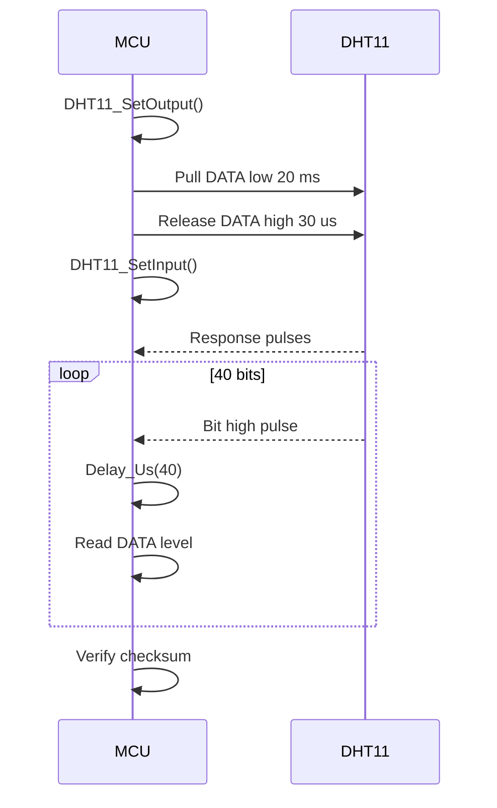
```mermaid
sequenceDiagram
  participant MCU
  participant DHT11
  MCU->>MCU: DHT11_SetOutput()
  MCU->>DHT11: Pull DATA low 20 ms
  MCU->>DHT11: Release DATA high 30 us
  MCU->>MCU: DHT11_SetInput()
  DHT11-->>MCU: Response pulses
  loop 40 bits
    DHT11-->>MCU: Bit high pulse
    MCU->>MCU: Delay_Us(40)
    MCU->>MCU: Read DATA level
  end
  MCU->>MCU: Verify checksum
```

| Function | Why it exists |
|---|---|
| `DHT11_SetOutput()` | Lets the MCU pull the bus low for the start signal |
| `DHT11_SetInput()` | Releases the bus so the sensor can drive data |
| `DHT11_WaitLevel()` | Waits for expected high/low transitions with timeout protection |
| `Dht11::read()` | Orchestrates the whole protocol and returns success/failure |

DHT11 reads are separated by `DHT11_PERIOD_MS = 2100`; with the 1-second frame period this refreshes about every 3 seconds. If DHT11 fails, the system keeps running and sets `STATUS_DHT_ERROR` in the frame instead of blocking the whole node.

## 6. Frame Protocol

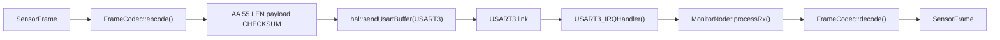
```mermaid
flowchart LR
  S["SensorFrame"] --> E["FrameCodec::encode()"]
  E --> B["AA 55 LEN payload CHECKSUM"]
  B --> U["hal::sendUsartBuffer(USART3)"]
  U --> R["USART3 link"]
  R --> I["USART3_IRQHandler()"]
  I --> P["MonitorNode::processRx()"]
  P --> D["FrameCodec::decode()"]
  D --> T["SensorFrame"]
```

| Function | Design role |
|---|---|
| `FrameCodec::checksum()` | Adds `LEN + payload` and returns the low 8 bits |
| `FrameCodec::encode()` | Converts `SensorFrame` to the fixed 22-byte v2 wire format |
| `FrameCodec::decode()` | Verifies header, length, checksum, then rebuilds `SensorFrame` |
| `MonitorNode::processRx()` | Re-synchronizes on `AA 55` and rejects bad frames |

Frame bytes:

| Index | Field | Meaning |
|---|---|---|
| 0-1 | `AA 55` | Header |
| 2 | `LEN` | Fixed v2 payload length `18` |
| 3 | `VER` | Protocol version `2` |
| 4-5 | `TEMP/HUMI` | DHT11 values |
| 6-13 | `MQ135/MQ2/RAIN/THERM` | ADC readings, high byte first |
| 14-15 | `THERM_C10` | Thermistor temperature in 0.1 deg C |
| 16-18 | `FLAME/RAIN_WET/THERM_HOT` | Boolean sensor flags |
| 19 | `SEQ` | Rolling sequence number |
| 20 | `STATUS` | bit0 DHT error, bit1 therm hot, bit2 rain wet, bit3 therm ADC fault |
| 21 | `CHECKSUM` | Low 8 bits of `LEN + payload` |

## 7. Board B Receive Design

The USART interrupt stores bytes only; parsing happens in the main loop.

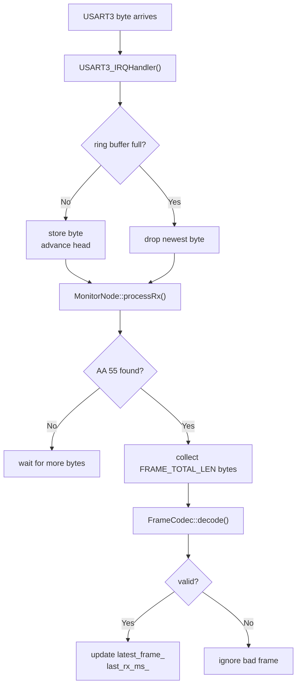
```mermaid
flowchart TD
  RX["USART3 byte arrives"] --> ISR["USART3_IRQHandler()"]
  ISR --> FULL{"ring buffer full?"}
  FULL -->|"No"| PUSH["store byte\nadvance head"]
  FULL -->|"Yes"| DROP["drop newest byte"]
  PUSH --> PROC["MonitorNode::processRx()"]
  DROP --> PROC
  PROC --> SYNC{"AA 55 found?"}
  SYNC -->|"No"| WAIT["wait for more bytes"]
  SYNC -->|"Yes"| LEN["collect FRAME_TOTAL_LEN bytes"]
  LEN --> DEC["FrameCodec::decode()"]
  DEC --> OK{"valid?"}
  OK -->|"Yes"| UPDATE["update latest_frame_\nlast_rx_ms_"]
  OK -->|"No"| BAD["ignore bad frame"]
```

This keeps the ISR short and predictable. A bad or partial frame can only be dropped; it cannot corrupt the latest valid display data.

## 8. Board B Cooperative Scheduler

`MonitorNode::run()` is a cooperative super-loop.

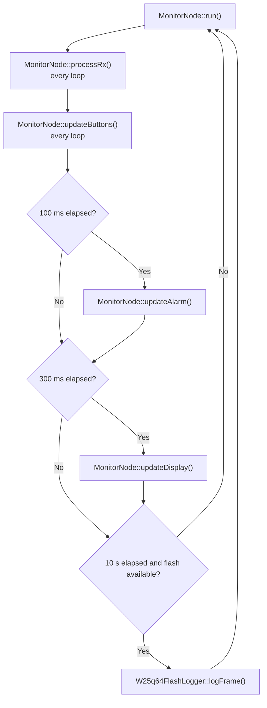
```mermaid
flowchart TD
  L["MonitorNode::run()"] --> RX["MonitorNode::processRx()\nevery loop"]
  RX --> BTN["MonitorNode::updateButtons()\nevery loop"]
  BTN --> A{"100 ms elapsed?"}
  A -->|"Yes"| AL["MonitorNode::updateAlarm()"]
  A -->|"No"| U
  AL --> U{"300 ms elapsed?"}
  U -->|"Yes"| UI["MonitorNode::updateDisplay()"]
  U -->|"No"| F
  UI --> F{"10 s elapsed and flash available?"}
  F -->|"Yes"| FL["W25q64FlashLogger::logFrame()"]
  F -->|"No"| L
  FL --> L
```

| Task | Frequency | Function | Reason |
|---|---|---|---|
| RX parsing | Every loop | `MonitorNode::processRx()` | Keep serial data from piling up |
| Buttons | Every loop | `MonitorNode::updateButtons()` | Make K1/K2 responsive |
| Alarm | 100 ms | `MonitorNode::updateAlarm()` | Keep buzzer/LED patterns smooth |
| OLED | 300 ms | `MonitorNode::updateDisplay()` | Avoid wasting time refreshing too often |
| Flash log | 10 s | `W25q64FlashLogger::logFrame()` | Reduce flash write frequency |

## 9. Button Interaction

`MonitorNode::updateButtons()` uses edge detection instead of blocking waits.

| Button | Action | State variable |
|---|---|---|
| K1 press | Switch OLED page | `page_` |
| K2 short press | Mute buzzer for 60 s | `g_mute_until_ms` |
| K2 long press | Cycle threshold profile | `threshold_profile_` |

The mute state only affects the buzzer. LED color still reflects the true system status.

## 10. Alarm Priority

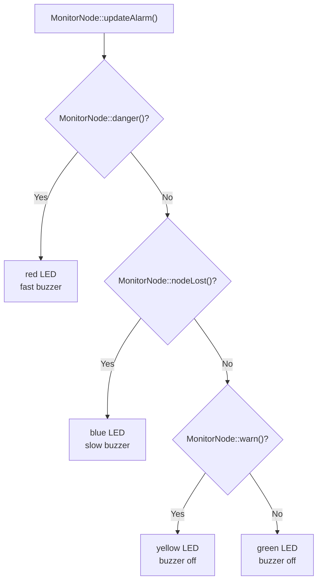
```mermaid
flowchart TD
  D["MonitorNode::updateAlarm()"] --> A{"MonitorNode::danger()?"}
  A -->|"Yes"| RED["red LED\nfast buzzer"]
  A -->|"No"| L{"MonitorNode::nodeLost()?"}
  L -->|"Yes"| BLUE["blue LED\nslow buzzer"]
  L -->|"No"| W{"MonitorNode::warn()?"}
  W -->|"Yes"| YELLOW["yellow LED\nbuzzer off"]
  W -->|"No"| GREEN["green LED\nbuzzer off"]
```

| Function | Meaning |
|---|---|
| `MonitorNode::nodeLost()` | No valid sensor frame for more than 3 seconds |
| `MonitorNode::danger()` | Flame detected or MQ2 reaches danger threshold |
| `MonitorNode::warn()` | DHT11 error, MQ135 warning, MQ2 warning, or node-lost state |
| `MonitorNode::updateAlarm()` | Applies priority and drives `BoardRgb::set()` / `Buzzer::set()` |

Priority order is danger, node-lost, warning, normal. This prevents stale or missing data from being shown as normal.

## 11. OLED Display Stack

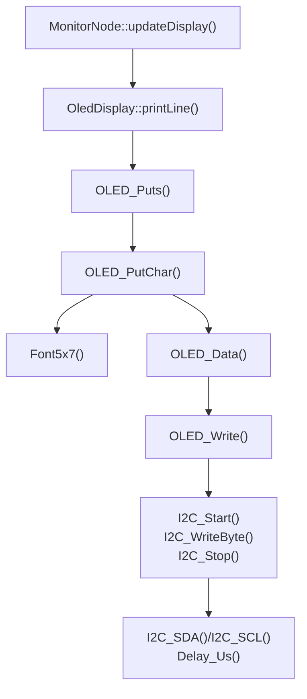
```mermaid
flowchart TD
  APP["MonitorNode::updateDisplay()"] --> LINE["OledDisplay::printLine()"]
  LINE --> PUTS["OLED_Puts()"]
  PUTS --> CHAR["OLED_PutChar()"]
  CHAR --> FONT["Font5x7()"]
  CHAR --> DATA["OLED_Data()"]
  DATA --> WRITE["OLED_Write()"]
  WRITE --> I2C["I2C_Start()\nI2C_WriteByte()\nI2C_Stop()"]
  I2C --> GPIO["I2C_SDA()/I2C_SCL()\nDelay_Us()"]
```

| Layer | Functions | Responsibility |
|---|---|---|
| Page layer | `MonitorNode::updateDisplay()` | Decide which four text lines to show |
| Text layer | `OledDisplay::printLine()`, `OLED_Puts()`, `OLED_PutChar()`, `Font5x7()` | Convert strings into pixel columns |
| OLED command layer | `OledDisplay::initController()`, `OledDisplay::clear()`, `OBoardRgb::setCursor()`, `OLED_Cmd()`, `OLED_Data()` | Talk to the SSD1306 controller |
| Software-I2C layer | `I2C_Start()`, `I2C_Stop()`, `I2C_WriteByte()`, `I2C_SDA()`, `I2C_SCL()`, `I2C_Delay()` | Generate the GPIO-based I2C waveform |

## 12. Optional W25Q64 Logging

Flash logging is optional: if the JEDEC ID is not valid, monitoring continues without logging.

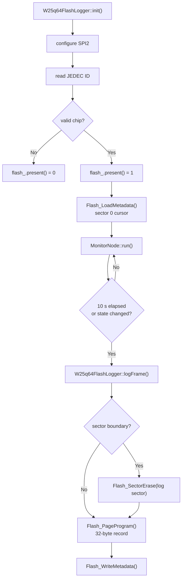
```mermaid
flowchart TD
  I["W25q64FlashLogger::init()"] --> SPI["configure SPI2"]
  SPI --> ID["read JEDEC ID"]
  ID --> OK{"valid chip?"}
  OK -->|"No"| OFF["flash_.present() = 0"]
  OK -->|"Yes"| ON["flash_.present() = 1"]
  ON --> META["Flash_LoadMetadata()\nsector 0 cursor"]
  META --> RUN["MonitorNode::run()"]
  RUN --> LOG{"10 s elapsed\nor state changed?"}
  LOG -->|"Yes"| REC["W25q64FlashLogger::logFrame()"]
  REC --> WRAP{"sector boundary?"}
  WRAP -->|"Yes"| ERASE["Flash_SectorErase(log sector)"]
  WRAP -->|"No"| PP
  ERASE --> PP["Flash_PageProgram()\n32-byte record"]
  PP --> META2["Flash_WriteMetadata()"]
  LOG -->|"No"| RUN
```

| Function | Purpose |
|---|---|
| `Flash_CS()` | Control chip select |
| `SPI2_TxRx()` | Transfer one SPI byte |
| `Flash_ReadStatus()` / `Flash_WaitReady()` | Wait until erase/program operations finish |
| `Flash_WriteEnable()` | Enable write/erase operations |
| `Flash_SectorErase()` | Erase one 4 KB sector |
| `Flash_PageProgram()` | Write one short record |
| `W25q64FlashLogger::init()` | Detect a compatible chip and restore circular-log cursor metadata |
| `Flash_LoadMetadata()` / `Flash_WriteMetadata()` | Restore and append sector 0 cursor entries |
| `W25q64FlashLogger::logFrame()` | Save one fixed 32-byte v2 circular-log record |

## 13. Debug Logging

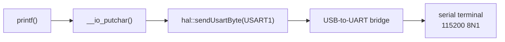
```mermaid
flowchart LR
  P["printf()"] --> C["__io_putchar()"]
  C --> U["hal::sendUsartByte(USART1)"]
  U --> CH["USB-to-UART bridge"]
  CH --> PC["serial terminal\n115200 8N1"]
```

USART1 is reserved for debug logs because the reference design routes `PA9/PA10` to a USB-UART bridge.

## 14. Shared State Variables

| Variable | Written by | Read by | Purpose |
|---|---|---|---|
| `latest_frame_` | `MonitorNode::processRx()` | display, alarm, flash logic | Latest valid sensor data |
| `last_rx_ms_` | `MonitorNode::processRx()` | `MonitorNode::nodeLost()` | Node-lost timing |
| `page_` | `MonitorNode::updateButtons()` | `MonitorNode::updateDisplay()` | OLED page selection |
| `threshold_profile_` | `MonitorNode::updateButtons()` | warning/danger/display/logging | Current threshold profile |
| `g_mute_until_ms` | `MonitorNode::updateButtons()` | `MonitorNode::updateAlarm()` | Buzzer mute deadline |
| `flash_.present()` | `W25q64FlashLogger::init()` | display/logging | Whether optional flash exists |
| `log_addr_` | `W25q64FlashLogger::logFrame()` | `W25q64FlashLogger::logFrame()` | Next log address |
| `RxRingBuffer` | ISR and `hal::readUsartByte()` | `MonitorNode::processRx()` | USART3 receive handoff |

## 15. End-To-End Data Path

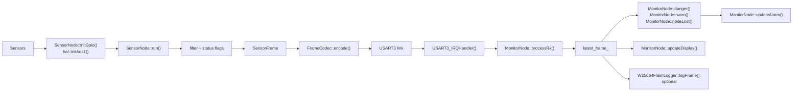
```mermaid
flowchart LR
  A["Sensors"] --> B["SensorNode::initGpio()\nhal::initAdc1()"]
  B --> C["SensorNode::run()"]
  C --> D["filter + status flags"]
  D --> E["SensorFrame"]
  E --> F["FrameCodec::encode()"]
  F --> G["USART3 link"]
  G --> H["USART3_IRQHandler()"]
  H --> I["MonitorNode::processRx()"]
  I --> J["latest_frame_"]
  J --> K["MonitorNode::danger()\nMonitorNode::warn()\nMonitorNode::nodeLost()"]
  K --> L["MonitorNode::updateAlarm()"]
  J --> M["MonitorNode::updateDisplay()"]
  J --> N["W25q64FlashLogger::logFrame() optional"]
```

The flow is intentionally modular: sampling, framing, reception, alarm decisions, display output, and optional logging are separate stages connected by a small set of state variables.

## 16. Fault Handling

| Fault | Detection point | Response |
|---|---|---|
| DHT11 read failure | `Dht11::read()` returns `0` | Board A still sends a frame with `STATUS_DHT_ERROR` |
| Serial noise or byte slip | `FrameCodec::decode()` fails | Bad frame is ignored; parser resynchronizes on `AA 55` |
| RX buffer full | `USART3_IRQHandler()` | Drop newest byte instead of blocking inside ISR |
| Board A disconnected | `MonitorNode::nodeLost()` | OLED shows `NODE LOST`; blue LED and slow buzzer |
| Flash not connected | `W25q64FlashLogger::init()` | `flash_.present()=0`; core monitoring still works |
| Flash log wrap | `W25q64FlashLogger::logFrame()` | Keep metadata in sector 0 and wrap 32-byte records across the 8 MB log area |
| Clock configuration failure | `SystemClock_Config()` | `Error_Handler()` disables interrupts and stops |
| Full assert failure | `assert_failed()` | Hook kept for future debug output |

## 17. Project Walkthrough Notes

A concise project walkthrough can follow this order:

1. Show the dual-node architecture: Board A samples, Board B displays and alarms, USART3 links them.
2. Explain why USART1 is reserved for USB-UART debug logs.
3. Walk through Board A: DHT11 timing, MQ/rain/thermistor ADC sampling, flame input, smoothing, frame encoding.
4. Walk through Board B: interrupt ring buffer, frame resynchronization, checksum, OLED/alarm/button/external RGB logic.
5. Explain robustness: DHT11/thermistor status bits, bad-frame rejection, node-lost detection, circular flash logging.

The project can be summarized as a small dual-MCU safety-monitoring system with clear node roles, a defined serial protocol, cooperative scheduling, and explicit recovery behavior.
