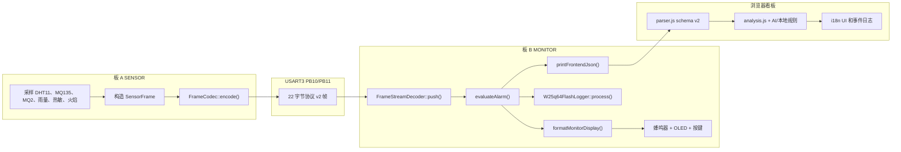
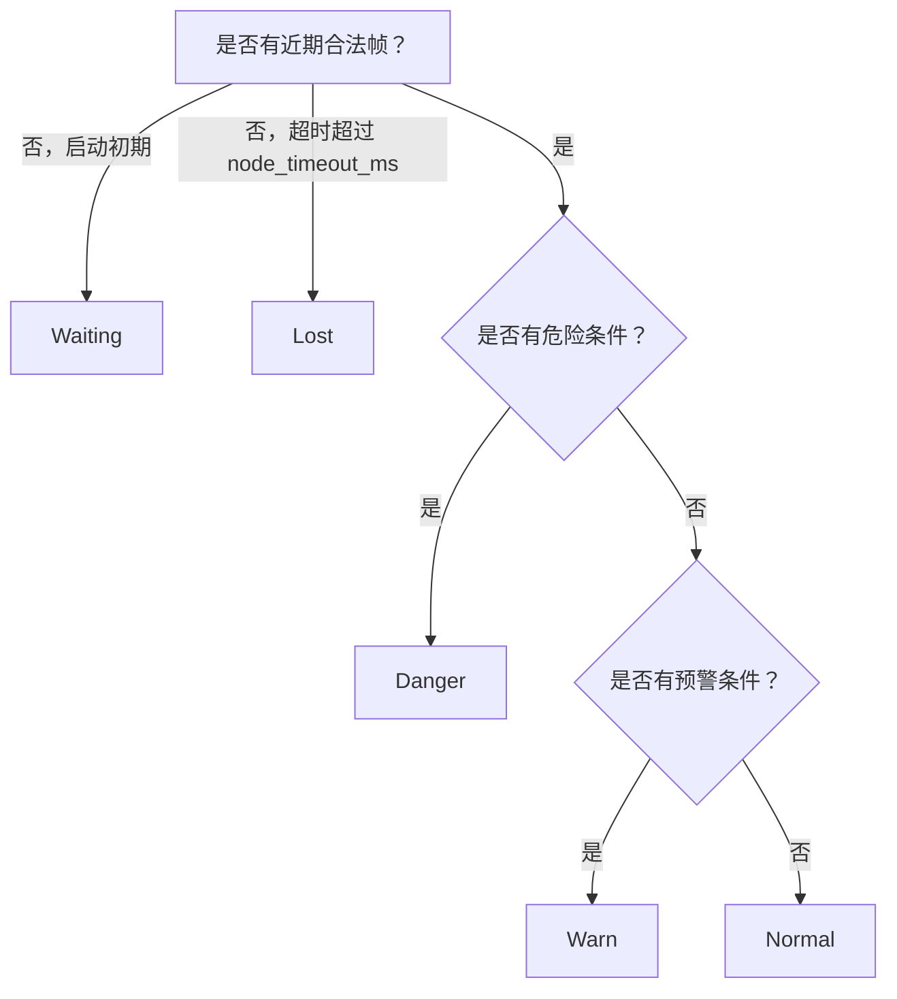

# 功能设计 Walkthrough

[中文 README](../README.zh-CN.md) | [English](FUNCTION_DESIGN_WALKTHROUGH.en.md) | [函数说明](FUNCTION_GUIDE.zh-CN.md) | [项目结构](PROJECT_STRUCTURE.zh-CN.md)

这份 walkthrough 说明当前后端如何作为一个完整双板系统工作。内容对应当前 CMake 构建：SENSOR 采集、MONITOR 流式解码、OLED、蜂鸣器、按键、可选 W25Q64 记录和 Web Serial JSON 输出。

## 系统流程



## 角色选择

`CMakePresets.json` 选择 `APP_NODE_ROLE`；`Core/Src/main.cpp` 根据这个编译期角色只实例化一个节点对象。

| Preset | 编译定义 | 主对象 | 输出 |
|---|---|---|---|
| `SensorDebug` / `SensorRelease` | `APP_NODE_ROLE=1` | `SensorNode` | `Env-Monitor_sensor.*` |
| `MonitorDebug` / `MonitorRelease` | `APP_NODE_ROLE=2` | `MonitorNode` | `Env-Monitor_monitor.*` |

通用初始化总是先执行：HAL、72 MHz 系统时钟、板级 GPIO、DWT 延时、USART1 调试/JSON、USART3 板间通信。MONITOR 角色会开启 USART3 RX 中断，让字节先进入环形缓冲，主循环继续协作式运行。

## SENSOR 后端

`SensorNode::run()` 每 `sensor_period_ms` 发送一帧。

| 输入 | 来源 | 数据帧字段 |
|---|---|---|
| DHT11 温湿度 | `Dht11::read()` 每 `dht11_period_ms` 读取 | `temp`、`humi`、`DhtError` 状态位 |
| MQ135 | `PA4` 上 ADC1 channel 4 | `mq135_adc` |
| MQ2 | `PA5` 上 ADC1 channel 5 | `mq2_adc` |
| 雨量模块 | `PA6` 上 ADC1 channel 6 | `rain_adc`、`rain_wet`、`RainWet` 状态位 |
| 热敏 AO | `PA7` 上 ADC1 channel 7 | `therm_adc`、`therm_c10`、`ThermAdcError` 状态位 |
| 热敏 DO | GPIO `PB9`，低电平有效 | `therm_hot`、`ThermHotDigital` 状态位 |
| 火焰 DO | GPIO `PB13`，低电平有效 | `flame` |

MQ、雨量和热敏模拟量在第一次采样后使用小型平滑滤波。热敏换算刻意使用查表方式，避免运行时浮点。极端无效 ADC 会标记热敏 ADC 异常位，并把热敏温度报告为 0。

## 协议 v2

线缆格式固定长度，便于用串口分析工具观察。

```text
AA 55 LEN VER TEMP HUMI MQ135 MQ2 RAIN THERM_ADC THERM_C10 FLAME RAIN_WET THERM_HOT SEQ STATUS CHECKSUM
```

| 属性 | 当前值 |
|---|---|
| 帧头 | `0xAA 0x55` |
| 版本 | `2` |
| 负载长度 | `18` |
| 总长度 | `22` |
| 多字节顺序 | 16 位字段使用大端 |
| 校验和 | `LEN + payload bytes` 的低 8 位 |

`FrameStreamDecoder` 存在的原因是 MONITOR 接收的是字节流，不是天然切好的包。它维护一个小缓冲区，等待 `AA 55`，处理重叠帧头，拒绝坏帧，然后继续寻找下一帧，并且不会阻塞主循环。

## MONITOR 调度器

`MonitorNode::run()` 是协作式循环。每轮只做少量工作并尽快返回下一轮。

| 任务 | 周期 | 函数 |
|---|---|---|
| 消化接收字节 | 每轮循环 | `processRx()` |
| 扫描按键 | 每轮循环 | `updateButtons()` |
| 推进 Flash 状态机 | 每轮循环 | `flash_.process()` |
| 重算报警和蜂鸣器 | 每 `alarm_period_ms` | `evaluateAlarm()`、`updateAlarm()` |
| 刷新 OLED | 每 `ui_period_ms` | `formatMonitorDisplay()`、`updateDisplay()` |
| 调度 Flash 记录 | 状态变化或每 `flash_log_period_ms` | `flash_.logFrame()` |

这个设计避免主循环长时间等待。Flash 擦除/写入完成由 `W25q64FlashLogger::process()` 轮询，因此 Flash 操作进行时，显示和串口接收仍保持响应。

## 报警评估

`evaluateAlarm()` 把最新数据帧和 MONITOR 的时间状态转换成紧凑的 `AlarmEvaluation`。



危险条件包括火焰触发、MQ2 达到危险阈值、热敏 DO 高温触发，或热敏温度超过当前档位危险阈值。预警条件包括 DHT11 错误、MQ135 预警阈值、MQ2 预警阈值、雨量湿态、雨量 ADC 超过湿态阈值、热敏 ADC 异常，或热敏温度超过预警阈值。

K2 短按会设置 `mute_until_ms = now + mute_time_ms`。静音只影响蜂鸣器；报警状态、OLED、JSON 和 Flash 记录仍反映真实风险状态。

## OLED 与按键

`DisplayFormatter` 把 OLED 文本构造从 MONITOR 主循环中拆出来。

| 页面 | 内容 |
|---|---|
| Page 0 | 状态标题、DHT11 温湿度、MQ135/MQ2、雨量/热敏 |
| Page 1 | 阈值档位、预警/危险阈值、序号、Flash 是否存在、Flash 记录数 |

K1 在 page 0/page 1 之间切换。K2 短按让蜂鸣器静音 60 秒。K2 长按循环切换 `App/Config.hpp` 中的 `threshold_profiles`。

## 可选 W25Q64 记录

记录器是可选的。如果 JEDEC ID 不匹配支持的 W25Q64 兼容器件，`present()` 返回 false，MONITOR 会继续运行但不记录。

| 区域 | 格式 |
|---|---|
| Sector 0 | 16 字节游标元数据，包含 magic、version、log address、record count、CRC |
| Sector 1 到末尾 | 32 字节环形记录，包含帧数据、报警状态、tick、档位、静音标志、记录计数、CRC |

当报警状态变化或周期记录间隔到期时，会调度一条记录。只有下一条环形写入到达扇区边界时，logger 才擦除对应扇区。

## JSON Lines 与前端 Schema

每接收一帧合法数据，`MonitorNode::printFrontendJson()` 就通过 USART1 输出一个 JSON 对象。当前固件输出 schema v2。

```json
{
  "type": "sensor",
  "schemaVersion": 2,
  "seq": 31,
  "tickMs": 123456,
  "tempC": 26,
  "humidityPct": 54,
  "mq135Raw": 1020,
  "mq2Raw": 860,
  "rainRaw": 980,
  "thermRaw": 1660,
  "thermC10": 325,
  "rainWet": 0,
  "thermHot": 0,
  "flame": 0,
  "status": 0,
  "alarm": "normal",
  "thresholdProfile": 0,
  "mute": 0,
  "flashReady": 1,
  "flashRecords": 42,
  "externalRgb": 0
}
```

前端 parser 会兼容旧 schema v1 记录，并把雨量/热敏/Flash 记录数扩展字段填为 `null` 或 `0`。schema v2 记录必须包含扩展字段。`externalRgb` 是 legacy placeholder，当前 JSON 输出中可能出现，但它不是看板必需字段，也不表示当前 CMake 构建会驱动 WS2813/RGB 硬件。看板超过 `STALE_AFTER_MS` 没有收到新帧后会标记数据超时，并按节点离线风险显示，即使最后一行 JSON 仍是 `normal`。

## 故障处理

| 情况 | 处理 |
|---|---|
| USART3 噪声或错位 | `FrameStreamDecoder` 丢弃坏字节并寻找下一组合法帧头。 |
| 校验和错误 | decoder 返回 `BadFrame`；MONITOR 打印 bad-frame 日志并恢复。 |
| 板 A 静默 | 报警评估在超时后从 waiting 转为 lost。 |
| DHT11 读取错误 | SENSOR 设置状态位 0；MONITOR 作为预警处理。 |
| 热敏 ADC 无效 | SENSOR 设置状态位 3；MONITOR 作为预警处理，并避免用无效温度判断危险。 |
| W25Q64 未接或超时 | logger 禁用自己；MONITOR 继续运行。 |
| 浏览器不支持 Web Serial | 看板提供回放模式和本地化提示文本。 |

## i18n 边界

运行时 i18n 实现在浏览器看板和文档中。固件 OLED 与调试串口字符串保持紧凑英文/协议字段，以节省 Flash/RAM，并保持串口输出对 parser 稳定。
